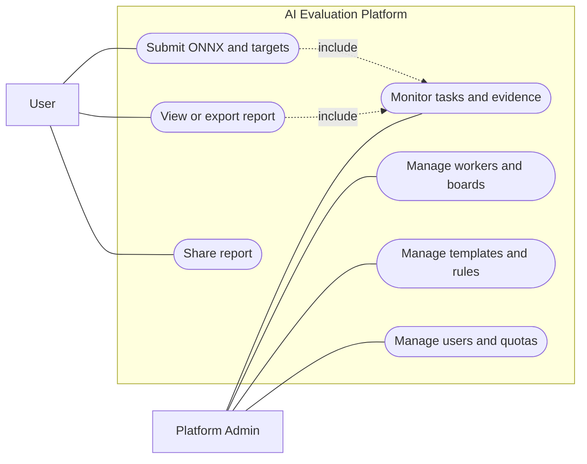
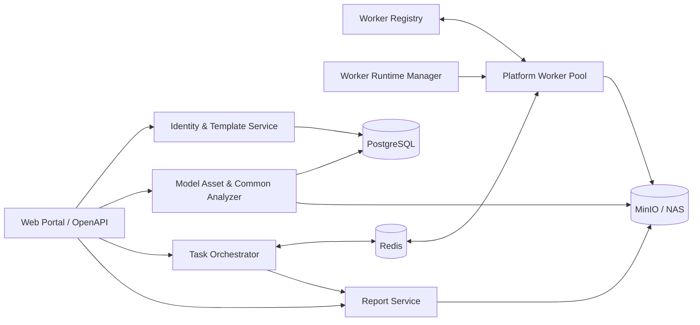
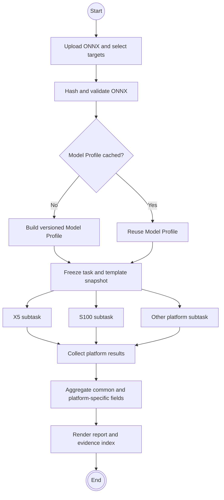
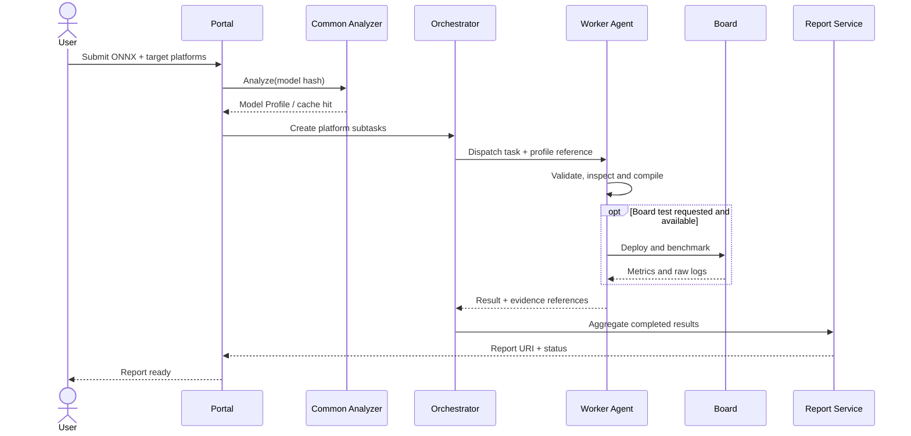
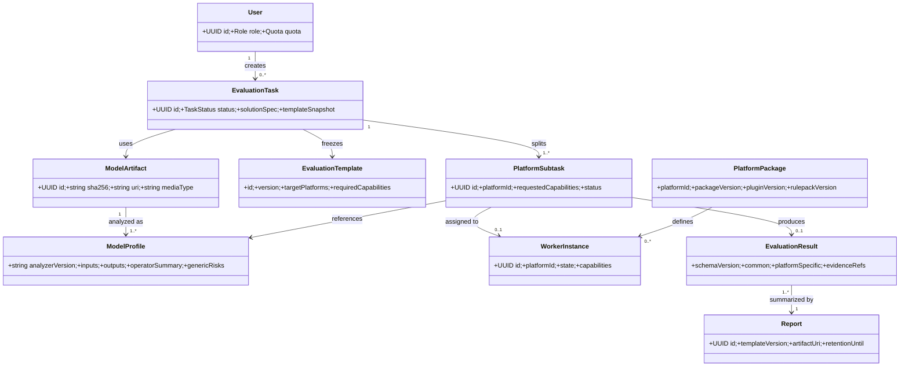
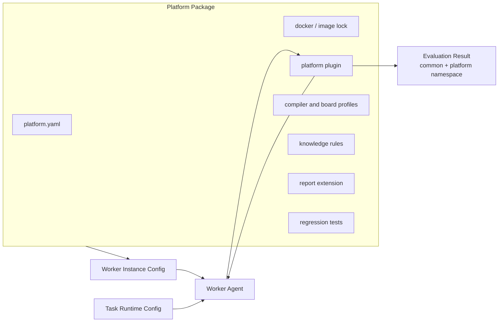
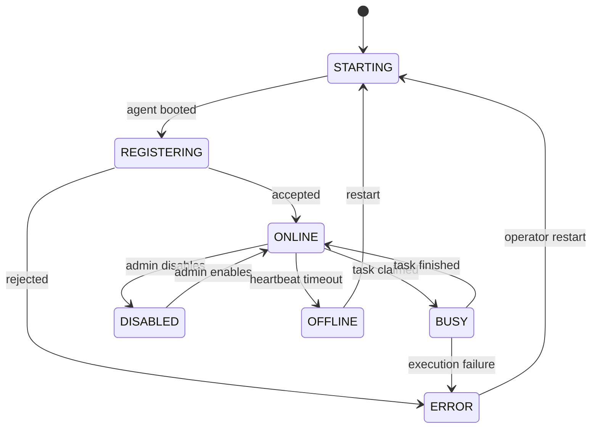
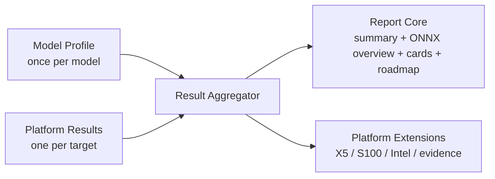
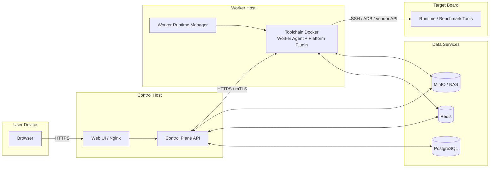

# AI 方案评估与建议专家平台设计文档

**文档版本：** V1.1（M1-A 目标架构评审稿）
**初始场景：** 单个 ONNX 模型的多芯片平台适配评估
**首个真实平台：** Horizon X5
**术语说明：** 本文中的 **Worker Host** 指安装 Docker 的执行服务器；**Worker Agent** 指运行于 Worker Host 的常驻执行服务；**工具链容器**指 Agent 按任务启动的短时 Docker 容器。三者不能混用。

---

## 0. 执行摘要

平台的首期目标不是构建一个“大而全”的 AI 评测系统，而是形成一条可运行、可复用、可横向比较的闭环：客户提交一个 ONNX 模型，系统先完成一次与芯片无关的通用模型分析，再将同一模型及其 `Model Profile` 分发给 X5、S100 等平台 Worker，完成平台专用检查、模型编译和可选板端实测，最终生成统一报告。

首期客户报告延续既定的三段式承诺：

1. ONNX 模型检测概要；
2. 各平台适配与板端测试结果；
3. 后续优化建议。

为方便决策，报告首页增加“多平台评估结论摘要”。模型概要只分析、存储和展示一次；每个平台以统一评估卡呈现公共指标，并通过平台扩展章节承载 BPU/CPU 落点、特定编译诊断等专有信息。

系统采用“**统一控制面 + 通用模型分析器 + 平台包 + Worker 实例**”架构。不同芯片继续使用各自工具链 Docker 和板卡，但遵循同一任务协议、结果 Schema、证据规则和报告骨架。新增平台时安装统一 Worker Agent、加载平台包并完成实例配置即可接入，不修改总管家核心逻辑。

## 1. 建设目标与范围

### 1.1 业务目标

平台面向算法工具链技术支持和客户方案评估，解决以下问题：

- 同一模型需要在多个芯片平台重复执行相似检查，过程难复用；
- 不同平台报告口径不一致，无法直接横向比较；
- 芯片工具链、Docker、板卡和经验规则各自独立，新增平台接入成本高；
- 算子限制、风险结构和优化经验散落在脚本或人员经验中，难以版本化沉淀；
- 评估结论与工具链、规则、日志和产物之间缺少可追溯关系。

首期应交付一条真实可用的 ONNX 多平台评估闭环，X5 作为首个真实 Worker，Mock Worker 用于联调，随后以 S100 或其他芯片验证横向扩展能力。

### 1.2 初始报告目标

最终报告固定采用下列骨架：

```text
封面与任务信息
0. 多平台评估结论摘要
1. ONNX 模型检测概要
2. 各平台适配与板端测试结果
3. 后续优化建议
附录：命令、日志、产物、规则版本与原始证据
```

| 报告部分 | 统一内容 | 平台差异处理 |
|---|---|---|
| 多平台结论摘要 | 可行性、编译、实测状态、性能结论、主要风险、推荐等级 | 使用统一枚举和单位；缺失值标记为“未验证” |
| ONNX 模型检测概要 | SHA256、IR/opset、输入输出、Shape、算子统计、通用风险 | 由通用分析器生成一次，不在 Worker 重复统计 |
| 平台适配与板端测试 | 工具链、算子支持、编译、产物、FPS/Latency/Memory、风险 | 统一评估卡 + 平台专有章节 |
| 后续优化建议 | 通用建议、平台建议、优先级、原因、预期收益 | 每条建议绑定证据等级与规则版本 |

### 1.3 核心设计原则

- **一次通用分析，多次平台评估：** 模型固有信息生成一个版本化 `Model Profile`，所有平台子任务引用它；`common-analyzer` 是不依赖任何芯片平台包的最小必备组件。
- **内容去重与引用隔离：** 同字节 ONNX 只保存一份内容对象；用户、项目和任务始终保持独立 Artifact 引用、权限和快照。
- **配置冻结：** 每个任务冻结分析器模块、参数、版本和依赖图，历史结果不受后续配置修改影响。
- **共性可比较，专有性不丢失：** 公共字段统一语义和单位；平台专有字段使用命名空间隔离。
- **控制面不包含工具链逻辑：** 控制面只管理身份、资产、模板、调度、结果和报告。
- **平台通过包接入：** Docker、插件、编译配置、板卡配置、规则和报告扩展统一放入 `Platform Package`。
- **Runner Release 受控执行：** Candidate 页面仅登记声明性资料；实际编译、板端调用只能来自 Git 审查后、经 Host 安装的固定 Runner。网页不能编辑 Runner、命令、Docker 参数、板端地址或凭据。
- **Worker 可安装、可注册、可运维：** 统一 Agent 负责注册、心跳、取任务、执行编排和结果回传。
- **事实、推断和未验证严格区分：** 报告不得把“规则推断”写成“编译或板端实测结论”。
- **版本化与可追溯：** 模型、分析器、平台包、工具链、规则包、结果 Schema 和报告模板均记录版本。
- **首期保持简单：** 控制面采用模块化单体和 Docker Compose，不提前引入 Kubernetes 或大量微服务。

### 1.4 首期范围与非目标

首期范围包括用户与角色、模型资产和通用 ONNX 分析、评估模板、Worker 与能力管理、任务调度、平台执行、结果汇总、报告生成与历史管理。

首期不建设自然语言自动拆解方案、多租户计费、Kubernetes 弹性伸缩、完整模型精度评测、功耗建模、复杂系统仿真和多层级策略引擎。相关能力可在主闭环稳定后扩展。

## 2. 参与者与系统用例

### 2.1 参与者

| 参与者 | 主要职责 |
|---|---|
| 普通用户 | 提交 ONNX 与目标平台，查看、导出和分享自己的报告 |
| 管理员 | 管理普通用户、模板、Worker、平台能力、任务和报告 |
| 超级管理员 | 管理管理员、全局配置和受控的最高权限操作 |
| Worker Agent | 注册、心跳、领取任务、调用平台插件并回传结果 |
| 目标板卡 | 接收模型或二进制，执行运行时与性能测试 |

### 2.2 UML 用例图



**图 2-1 UML 用例图。** 用户只面向评估任务和报告；管理员面向 Worker、板卡、模板和规则。普通用户不能直接传递 Docker 路径、板卡地址或任意工具链命令。

## 3. 系统总体架构

### 3.1 逻辑组件架构



**图 3-1 UML 组件图。** 控制面是模块化单体，内部模块边界清晰；工具链和板卡逻辑只存在于平台 Worker。通用 ONNX 分析器属于控制面公共能力，不隶属于任一芯片。

### 3.2 组件职责与边界

| 组件 | 负责 | 不负责 |
|---|---|---|
| Web Portal / OpenAPI | 用户交互、管理入口、任务与报告 API | 执行工具链命令 |
| Identity & Template | 登录、RBAC、用户配额、评估模板、报告模板 | 芯片规则与报告数据生成 |
| Model Asset & Common Analyzer | 模型入库、哈希、ONNX 校验、`Model Profile` | 判断某芯片支持性 |
| Task Orchestrator | 校验、拆分、调度、超时、重试、结果汇总 | 管理 Docker 进程细节 |
| Worker Registry | 注册、心跳、能力、负载、租约和状态 | 创建或删除容器 |
| Worker Runtime Manager | Worker Docker 的安装、配置、启停、升级和资源限制 | 业务调度与报告生成 |
| Worker Agent | 通用执行协议、工作目录、插件调用、制品回传 | 芯片专有判断逻辑 |
| Platform Plugin | 工具链调用、规则匹配、板端测试、平台结果 | 用户、权限、跨平台汇总 |
| Report Service | 标准化比较、报告模板渲染、导出和分享 | 修改历史评估结果 |

### 3.3 核心对象

系统固定使用以下对象：

```text
Solution Spec      本次客户方案和目标约束
Model Artifact     已入库且具有不可变哈希的模型文件
Model Profile      与芯片无关的通用 ONNX 分析结果
Evaluation Task    用户提交的总任务
Platform Subtask   面向某个平台的可调度子任务
Evaluator Capability  Worker 声明并经平台启用的能力
Evaluation Result  平台子任务的标准化结果
Report             基于结果快照与报告模板生成的交付物
```

## 4. ONNX 到报告的端到端设计

### 4.1 UML 活动图



**图 4-1 UML 活动图。** 通用分析发生在平台子任务创建前。只有模型 Profile 可用后，系统才进入多平台执行阶段。

### 4.2 UML 时序图



**图 4-2 UML 时序图。** Worker 获得的是模型引用、Profile 引用和受控任务配置，不获得任意宿主机控制权。板端测试是条件分支，不具备板卡条件时必须返回明确的 `NOT_EXECUTED` 原因。

### 4.3 分层执行步骤

#### 4.3.1 任务创建层

1. 用户选择评估方案模板、报告模板和目标平台。
2. 用户上传 ONNX，填写应用场景、输入规格、性能目标和是否要求板端实测。
3. 系统校验用户配额、文件类型、模板版本和最终可用能力。
4. 系统以流式方式计算 SHA256 与大小，先查重；只有内容未命中时才将临时接收文件提交到对象存储。
5. 系统创建带独立访问控制的 `Model Artifact` 引用，并按 `SHA256 + analyzer_config_snapshot + profile_schema_major` 查询 `Model Profile`。

#### 4.3.2 通用模型分析层

1. 缓存命中时复用 Profile；缓存未命中时执行 ONNX 解析和静态分析。
2. 分析器输出 IR/opset、输入输出、Shape、数据类型、算子统计、动态维度和通用结构风险。
3. 分析成功后冻结 Profile；失败时任务停留在 `VALIDATION_FAILED`，不创建平台子任务。
4. 总任务保存模型、Profile、评估模板和报告模板的版本快照。

#### 4.3.3 平台调度层

1. 每次用户提交创建一个 `EvaluationFlow`；每个目标平台在该 Flow 下生成独立的编译阶段和自动板端阶段。
2. 创建时冻结 Catalog、Binding、Worker、Runner Release、镜像锁、规则、制品格式、Evidence 家族和解析器版本；用户不能输入或改变这些执行资源。
3. 总管家计算最终能力：Worker 实际能力 ∩ 管理员启用能力 ∩ 用户授权能力，并按冻结的 Worker、编译槽位上限和板卡互斥规则调度。
4. 编译阶段可在同一 Binding 的多个容量槽位并行；每个槽位对应一个短时 Runner 容器和一个 PostgreSQL 租约。板端性能阶段在同一 Binding 上串行，不同 Binding 可并行。
5. 无可用执行条件时任务保持 `WAITING_RESOURCE` 或按超时规则终态并写明原因；不得写成“芯片不支持”，也不得静默改投其他 Worker。

#### 4.3.4 Worker 执行层

1. Agent 领取任务并复核 Flow 快照、租约、平台 ID、模型哈希和配置 Schema。
2. Agent 建立隔离工作目录，下载 ONNX、Profile 和必要输入。
3. 平台固定 Runner 执行编译，上传制品、日志和结果；只有同一 Flow、同一平台、同一编译阶段登记 SHA256 的制品可进入自动板端阶段。
4. 板端阶段经同一 Binding 的物理板卡互斥后，由平台专有受控适配器完成部署和性能采集。
5. Agent 上传各阶段独立的 Artifact、Evidence 和 `Evaluation Result`，并在成功、失败、取消、超时或迟到回传时幂等释放租约。
6. 清理临时缓存；模型、结果和证据按照保留策略处理。

#### 4.3.5 结果与报告层

1. 总管家校验结果 Schema、版本、任务归属和证据引用。
2. 多个平台结果分别终态后，按每个平台最后可达阶段汇总 Flow：全部成功、部分成功、失败、取消、超时或未执行；保留平台专有命名空间，不以一个平台成功覆盖另一个平台失败。
3. 报告服务生成结论摘要、模型概要、平台评估卡和优化建议。
4. 报告绑定所有版本快照并生成 HTML/PDF；用户可查看、导出或受控分享。

## 5. 模型资产与通用 ONNX 分析

### 5.1 为什么必须单独设计

输入、输出、IR/opset、算子类别和数量是模型固有事实。若每个 Worker 重复计算，会产生三类问题：浪费算力、不同工具实现造成统计不一致、报告同一模型出现多个“概要版本”。若完全不分析，则平台结果失去统一基线。

因此平台必须设置独立的通用分析阶段，对每个模型内容和分析器版本组合至少分析一次，并允许安全复用。

### 5.2 Model Profile 边界

`Model Profile` 包含：

- 模型 ID、SHA256、文件大小和存储引用；
- ONNX IR Version、opset imports；
- 输入输出名称、Shape、数据类型、动态维度；
- 节点总数、算子类别和数量；
- 初始值、外部数据、子图、控制流等基础信息；
- 与芯片无关的结构提示和通用风险；
- `analyzer_version`、Schema 版本、生成时间和分析日志引用。

它不包含任何芯片支持结论、BPU/NPU 落点、工具链编译结果或板端性能数据。

### 5.3 缓存和失效规则

```text
cache_key = onnx_sha256 + analyzer_version + profile_schema_major
```

- 模型内容未变化且分析器版本相同：直接复用；
- 模型重新导出导致哈希变化：生成新 Profile；
- 分析器算法、规则或字段含义变化：升级版本并重新分析；
- 仅报告展示样式变化：不重新分析；
- Profile 不允许原地覆盖，历史任务始终引用当时版本。

### 5.4 Worker 使用方式

Worker 必须校验本地 ONNX SHA256 与任务引用一致，然后基于同一 `Model Profile` 执行平台规则匹配。Worker 可以为判断算子约束而读取节点属性、常量和 Shape，但不得重新生成或覆盖通用模型概要。

### 5.5 上传去重与对象提交协议

上传不是“先写 MinIO，再计算哈希”。API 在受控临时接收区流式计算 SHA256、大小并执行限额检查；哈希完成后按内容键查询有效对象。命中时仅创建新的 Artifact 引用与任务关系；未命中时以 `models/sha256/<prefix>/<sha256>.onnx` 一类确定性对象键写入对象存储，并在事务中创建内容对象和 Artifact 元数据。

并发上传同一文件时，内容对象必须以唯一约束或等效锁保证只创建一次。内容去重不得泄露其他用户模型的存在性：共享的是经 SHA256 识别的底层内容对象，权限、项目归属、任务快照和下载授权均绑定各自的 Artifact 引用。

### 5.6 common-analyzer 模块配置与执行 DAG

`common-analyzer` 有不可关闭的核心 Profile 阶段，负责 ONNX 基础加载、输入输出提取和基础 Profile。当前基础检查固定包含 ONNX 合法性、IR/Opset、输入输出、节点与算子统计。扩展检查以已安装、版本化的模块定义管理；当前提供“模型文件与规模检查”和“动态 Shape 检查”，超级管理员可在“系统设置 → 通用 ONNX 检测策略”逐项启停。页面只提供已安装扩展项的布尔开关，禁止上传任意脚本、命令、路径、镜像或凭据；新增扩展项必须通过 Git 中可审查的 common-analyzer 模块实现并配套测试后才可出现在该列表中。

每个分析任务冻结 `AnalyzerConfigSnapshot`。执行图规则为：

| 阶段 | 方式 | 约束 |
|---|---|---|
| 文件接收、哈希、去重、对象提交 | 串行 | 成功后才创建分析任务 |
| 任务快照与 Redis 投递 | 串行 | PostgreSQL 成功提交后才能投递 |
| ONNX 基础加载与核心 Profile | 串行 | 是所有后续模块共同输入 |
| 无依赖可选模块 | 并行 | 受模块和 Worker 并发上限约束 |
| 依赖模块、聚合结果 | 依赖驱动 | 仅在依赖终态后执行 |

进度事件统一包含 `task_id`、`attempt_id`、`stage_id`、`module_id`、`status`、`progress_percent`、`sequence`、`occurred_at`、`analyzer_version`、`result_ref`、`error_code`。PostgreSQL 保存审计事实和结果引用，Redis 只承载调度与短期通知；进度按阶段权重单调推进，禁止伪造完成。

## 6. 领域模型与数据关系



**图 6-1 UML 类图。** `Evaluation Task` 是用户可见的总任务，`Platform Subtask` 是调度和执行单元；`Model Artifact` 与 `Model Profile` 独立于任务，可被多个任务复用。

### 6.1 最小数据表

| 表 | 核心内容 |
|---|---|
| `users` | 账户、角色、任务限额、并发和保留期 |
| `content_objects` | SHA256、大小、对象存储 URI、写入状态；同一内容仅一条 |
| `model_artifacts` | 受访问控制的内容对象引用、所有者、可见性与业务元数据 |
| `model_profiles` | Profile JSON、核心/模块结果、分析器快照、Schema 版本、状态 |
| `analyzer_modules` | 已安装模块、版本、Schema、默认参数和依赖声明 |
| `analyzer_config_snapshots` | 任务冻结的模块启停、参数、依赖图与并发上限 |
| `platform_packages` | 平台包、镜像、插件、规则包和默认配置版本 |
| `workers` | 实例、平台、状态、心跳、配置、镜像、运行数、并发上限和版本 |
| `worker_capabilities` | Worker 声明能力、平台启用状态和授权关系 |
| `evaluation_templates` | 输入要求、目标平台、能力、结果范围、版本 |
| `report_templates` | 章节、字段规则、主题、版本 |
| `evaluation_tasks` | 用户、Solution Spec、快照、状态 |
| `platform_subtasks` | 平台、Worker、租约、状态、运行配置 |
| `evaluation_results` | 标准结果 JSON、平台命名空间和证据索引 |
| `reports` | 报告文件、模板版本、分享和保留状态 |

二进制模型、日志、编译产物、性能原始数据和报告文件保存在 MinIO/NAS；数据库只保存可查询元数据、状态、权限、版本和 URI。

## 7. 业务子模块详细设计

### 7.1 用户、角色与配额

| 权限 | 普通用户 | 管理员 | 超级管理员 |
|---|:---:|:---:|:---:|
| 提交和管理自己的任务/报告 | ✓ | ✓ | ✓ |
| 查看全局任务与报告 | - | ✓ | ✓ |
| 创建和管理普通用户 | - | ✓ | ✓ |
| 创建和管理管理员 | - | - | ✓ |
| 管理 Worker、板卡、能力和模板 | - | ✓ | ✓ |
| 管理平台候选项、平台目录、Binding 和 Worker | - | ✓ | ✓ |
| 认领、续期、释放自己正在处理的平台候选项 | - | ✓ | ✓ |
| 强制接管或释放其他管理员有效处理权 | - | - | ✓ |
| 修改全局安全设置 | - | - | ✓ |

用户最小配置：`monthly_task_limit`、`max_concurrent_tasks`、`report_retention_days`、`enabled_capabilities`。超级管理员保持唯一，并提供受控交接机制。

#### 7.1.1 多管理员平台接入协作约定

本系统的角色权限控制（RBAC）只包含“普通用户、管理员、超级管理员”三种持久化角色；不新增“接入员”“审核员”等角色。平台候选项的接入、测试和审核是管理员在具体工作流中的动作，不是新的身份类型。

多个管理员可查看平台治理工作台，但同一候选项在同一时刻只能有一个**当前处理人**。管理员点击“认领候选项”后获得临时处理权：在处理权有效期内，只有当前处理人可以编辑接入材料、执行离线测试、创建待审核平台；其他管理员只能查看处理进度、证据和历史，不能覆盖或并行推进。当前处理人可以续期或释放处理权；处理权过期后，其他管理员可认领。超级管理员只在异常场景中带审计原因强制接管或释放处理权。

每次对候选项的修改均使用版本号进行冲突校验：若某管理员基于旧版本提交修改，系统拒绝覆盖并提示“内容已被更新”，要求其读取最新内容后再处理。认领、续期、释放、过期、测试、审核和异常接管均记录审计历史。

生产环境的身份验证必须“拒绝不可信身份”：未配置或未验证可信登录来源时，系统拒绝管理操作，不能把请求默认视为管理员。开发和自动化测试可使用明确开启的测试身份，但生产环境必须禁用。

平台工作台由后端生成统一视图，同一台 Agent 上同一镜像摘要只会被归入“可选择接入、接入中、已纳管”之一；前端不能自行把镜像和候选项拼接成多个状态。页面可继续每 5 秒局部刷新该统一视图，但刷新依据始终是后端的身份、角色、处理权和版本事实；SSE/WebSocket 仅作为后续体验优化，不是协作正确性的前提。

### 7.2 评估方案模板

评估方案模板定义“本次要评什么”，包含支持的输入类型、目标平台、必填字段、所需能力、执行阶段、结果要求、默认报告模板和版本。模板不定义工具链命令，也不负责报告视觉样式。

任务创建时完整冻结模板快照，模板后续升级不影响历史任务。

### 7.3 Worker 与能力管理

Worker 注册信息至少包括：Worker ID、平台 ID、Agent/镜像/工具链版本、平台包版本、板卡信息、声明能力、最大并发和运行标签。

能力采用唯一三方交集：

```text
最终可用能力 = Worker 实际能力 ∩ 管理员启用能力 ∩ 用户授权能力
```

能力不足的结果是“本次不可用/未执行”，不是“芯片不支持”。只有平台规则、真实编译或板端证据才能支持“受限/不支持”结论。

### 7.4 Worker Runtime Manager

Runtime Manager 负责 Worker Docker 的安装、实例化、网络、挂载、环境变量、资源限制、启停、重启、升级和健康探测。总管家只表达期望状态和调度任务，不直接运行 `docker run`。

### 7.5 任务调度

任务按平台拆分并进入平台队列。调度器依次检查平台匹配、能力匹配、Worker 状态、并发槽位、板卡租约和资源标签。任务领取使用租约和幂等键；Worker 失联后租约超时，任务进入可重试或人工处理状态。

同一平台首期默认串行执行，降低工具链和板卡资源冲突；不同平台可并行。若实际环境要求多个芯片串行，也可通过全局并发或队列优先级配置实现，不改变任务模型。

### 7.5.1 Worker 容量与繁忙状态

Worker Instance 必须上报健康状态、当前运行容器数、最大并发、空闲槽位、队列数、最近心跳、镜像版本和最近脱敏错误。状态统一为：

| 状态 | 含义 |
|---|---|
| `OFFLINE` | 未注册、心跳超时或不可达 |
| `DEGRADED` | 可达但自检、依赖、磁盘或运行条件异常 |
| `READY` | 健康且 `running_containers < max_concurrency` |
| `BUSY` | 健康但 `running_containers >= max_concurrency` |

Agent 领取任务时必须原子获取容量租约。若现有容器均在执行任务、但未达到该实例的并发上限，Agent 可以基于已预加载镜像启动新的短时容器；达到上限则任务保持 `QUEUED`。首期采用一任务一不可变短时容器，禁止为了吞吐而牺牲任务隔离；预热/复用容器作为独立优化项。

控制面应提供受 RBAC 保护的状态接口：

```text
GET /api/admin/worker-instances
GET /api/admin/worker-instances/{instance_id}/capacity
GET /api/admin/worker-instances/{instance_id}/health
```

### 7.6 报告模板与报告管理

报告模板只控制章节、字段显示、排序和视觉样式。一个评估结果可以生成“客户摘要版”和“技术详细版”，但两者引用相同不可变结果和证据。

报告支持历史查询、导出、受控分享和保留期。报告到期可删除文件，但应保留必要的任务、结果版本和删除记录；模型与大量日志可采用更短保留期。

### 7.7 制品与证据

证据对象至少记录：类型、URI、SHA256、产生阶段、平台、工具链版本、时间、关联规则和可见性。日志摘要可以进入报告，完整日志仅在授权范围内下载。

## 8. 平台包与 Worker Agent

### 8.1 UML 包/组件关系图



**图 8-1 UML 包与组件关系图。** 平台包定义平台的可交付能力；Worker 实例配置定义某台主机/板卡如何运行；任务运行配置只描述本次受控执行参数。

### 8.2 平台包目录规范

```text
platforms/<platform_id>/
├── platform.yaml
├── docker/
│   ├── Dockerfile
│   ├── compose.override.yaml
│   └── image.lock.yaml
├── plugin/
│   └── evaluator.py
├── config/
│   ├── toolchain.yaml
│   ├── compiler_profiles.yaml
│   └── board_profiles.yaml
├── knowledge/
│   ├── operator_support.yaml
│   ├── operator_constraints.yaml
│   ├── risk_rules.yaml
│   └── optimization_advice.yaml
├── report/
│   └── platform_sections.yaml
└── tests/
    ├── fixtures/
    └── regression.yaml
```

所有平台必须提供固定目录和 `platform.yaml`；可在命名空间内增加扩展文件。控制面只读取清单、Schema 和版本，不读取具体工具链实现。

### 8.3 三层配置

| 配置层 | 所有者 | 主要内容 | 变更方式 |
|---|---|---|---|
| Platform Profile | 平台包维护者 | 平台能力、镜像、插件、规则包、默认编译配置 | 随平台包发布 |
| Worker Instance Config | 管理员 | 镜像、网络、挂载、资源、板卡绑定、启用能力 | 管理界面或受控配置 |
| Task Runtime Config | 评估模板/用户授权输入 | 模型与 Profile 引用、编译 Profile、板卡 Profile、请求能力 | 创建任务时冻结 |

敏感参数如注册令牌和板卡凭据不得写入平台包或任务 JSON，应通过 Secret 挂载或受控凭据服务注入。

### 8.4 Worker Agent 安装包

```text
evaluation-worker-agent/
├── agent/                 # 注册、心跳、租约、任务与状态机
├── plugin_sdk/            # 平台插件接口和 Schema
├── plugins/               # 平台插件安装位置
├── board_drivers/         # SSH、ADB、共享目录、厂商 API
├── config/worker.yaml     # 非敏感实例配置
├── scripts/install.sh     # 安装与升级
├── scripts/register.sh    # 注册与连通性检查
└── service/               # 容器启动入口；可选 systemd 单元
```

Agent 固定负责注册、心跳、任务领取、工作目录管理、输入下载、插件调用、制品上传、状态回传和清理。平台插件最少实现：

```python
get_manifest() -> PlatformManifest
get_capabilities() -> list[Capability]
validate_task(task, model_profile) -> ValidationResult
execute(task, workspace, board_session=None) -> EvaluationResult
collect_evidence(workspace) -> list[EvidenceRef]
```

新增 Worker 的标准动作：安装 Agent → 安装平台包 → 配置服务端、平台 ID、工具链和板卡 → 执行连通性检查 → 注册 → 管理员审核能力 → 启用实例。

### 8.5 Worker 生命周期状态图



**图 8-2 UML 状态图。** `OFFLINE` 由心跳超时判定，`DISABLED` 是管理员主动禁止调度，`ERROR` 表示注册或执行故障，三者不可混用。

### 8.6 平台知识包

算子支持表、特殊限制、风险结构、工具链已知问题和优化建议以可审查 YAML/JSON 规则维护，不散落在流程代码中。规则至少包含 `rule_id`、适用平台/工具链范围、触发条件、风险级别、说明、建议、证据要求和规则版本。

```yaml
rule_id: x5-convtranspose3d-cpu-risk
applies_to:
  platform: horizon_x5
trigger:
  op_type: ConvTranspose
  tensor_rank: 5
risk:
  level: high
  title: 3D ConvTranspose may fall back to CPU
recommendation:
  - rewrite as ConvTranspose2d plus Reshape/Transpose
evidence_level: rule_inferred
```

规则命中只代表“规则推断”。若编译日志已确认 CPU 落点，则结果升级为“工具链验证”；若板端采样确认，则升级为“板端实测”。

## 9. 评估结果与报告设计

### 9.1 结果组成



**图 9-1 结果与报告组合图。** 模型概要来自 `Model Profile`，平台结果不复制该数据，只通过引用保证一致性。

### 9.2 推荐结果 Schema

```yaml
schema_version: "1.0"
task_id: "..."
subtask_id: "..."
platform:
  platform_id: "horizon_x5"
  worker_id: "x5-worker-01"
  worker_version: "1.0.0"
  platform_package_version: "1.0.0"
  toolchain_version: "..."
model_profile_ref:
  model_sha256: "..."
  analyzer_version: "1.0.0"
summary:
  feasibility: "DIRECT | OPTIMIZE | CONDITIONAL | BLOCKED | NOT_VERIFIED"
  compile_status: "PASSED | FAILED | NOT_EXECUTED"
  board_test_status: "PASSED | FAILED | NOT_EXECUTED"
common:
  compatibility:
    supported: 0
    constrained: 0
    unsupported: 0
    unknown: 0
  compile:
    artifact_uri: null
    artifact_size_bytes: null
  performance:
    latency_ms: null
    fps: null
    peak_memory_mb: null
platform_specific:
  horizon_x5: {}
risks: []
recommendations: []
evidence: []
versions:
  evaluation_template: "..."
  rulepack: "..."
```

公共字段不得存入平台专有含义不同的指标；无法统一定义的内容放入 `platform_specific.<platform_id>`。跨平台比较只使用公共字段和明确可比的单位。

### 9.3 平台评估卡

每个平台统一输出：平台/工具链/Worker 版本、可行性、算子支持统计、编译状态、模型产物、板端实测状态、延迟/FPS/内存、主要风险和证据等级。平台专有章节用于展开：

- X5：BPU/CPU 落点、march、HBM、工具链日志摘要、BPU 利用率与 DDR 风险；
- S100：加速器分区、编译诊断、专有性能指标；
- Intel：OpenVINO Device、Precision、执行图信息。

### 9.4 证据等级

| 等级 | 含义 | 报告写法 |
|---|---|---|
| `BOARD_MEASURED` | 已在指定板卡和配置真实执行 | “板端实测” |
| `TOOLCHAIN_VERIFIED` | 已由目标工具链解析或编译确认 | “工具链验证” |
| `RULE_INFERRED` | 基于版本化规则和模型属性推断 | “规则推断，需验证” |
| `NOT_VERIFIED` | 缺少执行条件或证据不足 | “未验证” |

### 9.5 版本策略

至少记录 `result_schema_version`、`analyzer_version`、`worker_version`、`platform_package_version`、`toolchain_version`、`rulepack_version`、`evaluation_template_version` 和 `report_template_version`。新增可选字段升级次版本；改变字段含义、必填性或单位升级主版本。

## 10. 部署架构与技术选型

### 10.1 UML 部署图



**图 10-1 UML 部署图。** Worker Host 可以与控制面分离部署；不同工具链 Docker 可位于不同主机并连接不同板卡。控制面不要求各 Worker 共用文件系统，通过对象存储 URI 和签名访问实现解耦。

### 10.2 技术选型

| 范围 | 首期选型 | 选择理由 |
|---|---|---|
| 后端控制面 | Python 3.10+、FastAPI、Pydantic | 便于 Schema 校验和复用现有评测脚本 |
| 前端 | React、TypeScript、Ant Design | 适合配置表单、任务状态和报告页面 |
| 数据库 | PostgreSQL | 元数据、权限、版本和任务状态需要事务 |
| 调度 | Redis Streams/Celery 二选一，首期统一一种 | 平台队列、租约和重试实现简单 |
| 对象存储 | MinIO S3 API；可适配 NAS | 模型、日志、产物和报告统一 URI |
| Worker | Python Agent + 平台 SDK；必要路径调用 C++ | 易安装进工具链 Docker，兼容厂商工具 |
| 报告 | Jinja2 HTML + PDF 导出 | 同一结果支持多种报告模板 |
| 部署 | Docker Compose | 符合首期规模与工具链 Docker 现实 |
| 协议 | REST + JSON Schema；大文件走对象存储 | 调试清晰、跨平台、可版本化 |

“Redis Streams 或 Celery”必须在详细设计阶段确定其一，避免同时维护两套任务语义。若需要严格消息确认和复杂路由，再评估 RabbitMQ。

### 10.3 安全与隔离

- 注册使用一次性或可轮换 Token，生产环境建议 mTLS；
- Worker 只访问指定队列、对象前缀和任务，不拥有全局管理权限；
- 板卡凭据使用 Secret 注入，不进入任务、日志或报告；
- 工作目录按任务隔离，限制 CPU、内存、磁盘和执行超时；
- 工具链命令必须由插件和 Profile 构造，不接受用户任意 Shell；
- 下载、分享和管理操作写入审计日志；
- 模型与客户日志按最小权限和保留期管理。

### 10.4 可观测性与故障处理

统一日志字段至少包括 `task_id`、`subtask_id`、`worker_id`、`platform_id`、`stage` 和 `trace_id`。指标包括队列长度、任务耗时、阶段成功率、Worker 心跳、并发槽位、板卡占用、对象上传失败率和报告生成耗时。

通用分析失败时不创建平台子任务；单个平台失败不影响其他平台完成。报告允许“部分成功”，但摘要必须显示失败/未执行平台及原因。任务重试以阶段幂等和制品哈希为基础，避免重复注册结果。

## 11. 接口与状态设计

### 11.1 最小 API

```text
POST /v1/models
GET  /v1/models/{model_id}/profile
POST /v1/evaluation-tasks
GET  /v1/evaluation-tasks/{task_id}
POST /v1/evaluation-tasks/{task_id}/cancel
POST /v1/platform-subtasks/{subtask_id}/retry
GET  /v1/reports/{report_id}

POST /v1/workers/registrations
POST /v1/workers/{worker_id}/heartbeats
GET  /v1/workers/{worker_id}/capabilities
POST /v1/platform-subtasks/{subtask_id}/claim
POST /v1/platform-subtasks/{subtask_id}/results
```

大文件不通过 JSON 直接上传；API 签发对象存储上传/下载凭据，消息中只传 URI、SHA256、大小和媒体类型。

### 11.2 任务状态

总任务状态：

```text
CREATED → VALIDATING → PROFILING → QUEUED → RUNNING
       → SUCCEEDED | PARTIAL_SUCCEEDED | FAILED | CANCELLED | TIMEOUT
```

平台子任务状态：

```text
CREATED → WAITING_RESOURCE → QUEUED → CLAIMED → RUNNING
       → SUCCEEDED | FAILED | SKIPPED | CANCELLED | TIMEOUT
```

`PARTIAL_SUCCEEDED` 只用于总任务；平台子任务必须有明确终态。状态变化通过受控事件完成，并保存原因码和时间。

## 12. 实施计划与任务拆分

### 12.1 P0：协议与工程基线

| 编号 | 任务 | 产出 | 验收 |
|---|---|---|---|
| P0-1 | 建立仓库、模块目录、Compose 和环境约定 | 可启动空工程 | 一条命令启动控制面和依赖 |
| P0-2 | 定义领域对象与 JSON Schema | Spec、Profile、Task、Result、Evidence | Schema 校验测试通过 |
| P0-3 | 建立数据库模型和迁移 | 12 张核心表及索引 | 可重复初始化与升级 |
| P0-4 | 建立对象存储目录与 URI 规范 | 模型/任务/平台/报告前缀 | 上传、下载、哈希校验通过 |
| P0-5 | 建立 Mock Worker | 注册、心跳、取任务、回传 | 端到端假数据闭环通过 |

### 12.2 P1：控制面与基础管理

| 编号 | 任务 | 产出 | 验收 |
|---|---|---|---|
| P1-1 | 登录、三角色 RBAC、配额 | 用户与权限 API/UI | 权限矩阵自动化测试通过 |
| P1-2 | 评估方案模板与报告模板 | CRUD、版本、启停、快照 | 历史任务不受模板更新影响 |
| P1-3 | Worker 注册和心跳 | Registry、状态、能力页面 | 超时后正确进入 OFFLINE |
| P1-4 | Runtime Manager 最小实现 | Compose 实例启停与配置 | 可创建、停止、重启 Mock Worker |
| P1-5 | 任务/子任务状态机 | 创建、取消、重试、超时 | 非法状态迁移被拒绝 |

### 12.3 P2：通用 ONNX 分析

| 编号 | 任务 | 产出 | 验收 |
|---|---|---|---|
| P2-1 | 模型入库和 SHA256 去重 | `Model Artifact` 服务 | 相同文件复用资产 |
| P2-2 | ONNX 基础分析器 | 输入输出、IR/opset、算子统计 | 与基准脚本结果一致 |
| P2-3 | Model Profile 缓存 | 版本化缓存与失效策略 | 相同 key 不重复分析 |
| P2-4 | 通用风险规则 | 动态 Shape、控制流等提示 | 规则命中可追溯 |
| P2-5 | 失败隔离 | Profile 失败阻断平台子任务 | 状态和原因码正确 |

### 12.4 P3：Worker Agent 与平台包规范

| 编号 | 任务 | 产出 | 验收 |
|---|---|---|---|
| P3-1 | Agent 核心 | 注册、心跳、租约、工作目录 | 容器内稳定运行 |
| P3-2 | Plugin SDK | 接口、Schema、示例插件 | Mock 插件通过契约测试 |
| P3-3 | Board Driver 接口 | SSH/ADB 基础适配 | 连通性和超时可控 |
| P3-4 | 安装/注册包 | 安装、升级、配置、诊断脚本 | 新容器可在 30 分钟内接入 |
| P3-5 | 平台包校验器 | 目录、清单、版本和规则校验 | 非法包拒绝发布 |

### 12.5 P4：X5 首个平台落地

| 编号 | 任务 | 产出 | 验收 |
|---|---|---|---|
| P4-1 | 重组现有 X5 ONNX 检查脚本 | X5 静态检查插件 | 输出符合 Result Schema |
| P4-2 | 接入算子支持与风险知识包 | X5 rulepack v1 | 规则版本进入结果 |
| P4-3 | 接入模型编译和日志解析 | X5 compile capability | 真实 ONNX 编译闭环 |
| P4-4 | 接入板端测试 | X5 board performance | 延迟/FPS/内存有原始证据 |
| P4-5 | 新旧脚本回归 | 对比基线与差异说明 | 关键结论一致，差异可解释 |

### 12.6 P5：报告与用户闭环

| 编号 | 任务 | 产出 | 验收 |
|---|---|---|---|
| P5-1 | 结果聚合与单位规范 | 多平台聚合器 | 未验证与不支持不混淆 |
| P5-2 | 三段式报告模板 | HTML/PDF 技术详细版 | 内容与证据可追溯 |
| P5-3 | 客户摘要模板 | 一页结论 + 平台对比 | 面向老板/客户可直接阅读 |
| P5-4 | 报告历史、导出和分享 | UI/API | 权限和保留期生效 |
| P5-5 | 异常/部分成功报告 | 失败平台原因展示 | 单平台失败仍能生成报告 |

### 12.7 P6：第二平台与横向验证

| 编号 | 任务 | 产出 | 验收 |
|---|---|---|---|
| P6-1 | 接入 S100 或第二平台 | 第二个平台包和 Worker | 不修改总管家核心代码 |
| P6-2 | 跨平台比较 | 统一评估卡和摘要 | 同一 ONNX 两平台可比 |
| P6-3 | 平台专有扩展 | 两个平台专有章节 | 不污染公共 Schema |
| P6-4 | 回归矩阵 | 样例模型、规则、工具链版本 | 平台包升级可自动回归 |

### 12.8 实施依赖与建议顺序

```text
P0 协议基线
 ├─ P1 控制面
 ├─ P2 通用分析
 └─ P3 Worker Agent
        ↓
     P4 X5 接入
        ↓
     P5 报告闭环
        ↓
     P6 第二平台与横向验证
```

P2 与 P3 可并行开发；P4 必须在 Profile、Agent 契约和 Result Schema 稳定后开始。第二个平台不是“未来可选项”，而是验证架构是否真正平台无关的必要验收步骤。

## 13. 首期验收标准

1. Compose 可启动控制面、PostgreSQL、Redis、对象存储和 Mock Worker。
2. 三角色权限、用户配额和报告访问范围按矩阵生效。
3. 相同 ONNX 和分析器版本只生成一个 `Model Profile`。
4. 通用分析失败时不创建平台子任务；单平台失败不阻断其他平台。
5. Worker 可注册、心跳、领取任务、调用插件、上传制品并回传结果。
6. 管理员可启停 Worker 与能力，系统正确计算三方能力交集。
7. X5 Worker 使用真实 ONNX 完成静态检查与编译；具备板卡时完成性能测试。
8. 报告包含结论摘要、一次模型概要、各平台评估卡和分层优化建议。
9. 每项重要结论可追溯到日志、产物、规则或板端原始数据。
10. 接入第二平台时不修改总管家核心代码和公共结果语义。
11. 模板、规则包或工具链升级不改变历史报告。
12. Worker 安装包可在新的工具链 Docker 中完成安装、配置、注册和自检。

## 14. 需要在评审中冻结的关键决策

| 决策项 | 建议基线 | 不冻结的后果 |
|---|---|---|
| 通用分析归属 | 控制面独立后台能力，后续可拆独立容器 | 各 Worker 重复实现并产生统计差异 |
| 队列实现 | Redis Streams 或 Celery 选定一种 | 状态、重试和租约语义不统一 |
| 结果 Schema v1 | 先冻结公共字段、状态和单位 | X5 接入后难以支持横向比较 |
| 板卡资源模型 | 独占租约，首期不共享 | 并发测试造成性能结果失真 |
| 平台包发布规则 | 清单 + 版本 + 契约测试 + 回归 | 规则和插件升级不可控 |
| 证据等级 | 四级枚举固定 | 规则推断和真实实测混淆 |
| 第二平台验收 | 纳入首期后段 | 架构可能只是 X5 脚本平台化包装 |

## 15. 部署形态、宿主边界与运行环境（新增冻结项）

### 15.1 最终部署形态

平台采用“控制面 + 平台执行面 + 目标板卡”的分层部署。控制面管理身份、模型资产、任务、结果、证据和报告；平台执行面持有各芯片工具链与板卡连接；目标板卡只执行受控推理/采集程序，不承载平台主服务。

```text
Browser
  → Nginx / Web Portal / API / Task Orchestrator / Report Service
  → PostgreSQL + Redis + MinIO/NAS
  → Worker Agent (X5 host)   → X5 toolchain Docker   → X5 board
  → Worker Agent (S100 host) → S100 toolchain Docker → S100 board
  → Worker Agent (Intel host)→ OpenVINO runtime      → Intel device
```

| 部署单元 | 推荐宿主 | 首期运行方式 | 后续扩展方式 | 禁止职责 |
|---|---|---|---|---|
| 控制面 | 通用 Linux 服务器 | Docker Compose | Kubernetes 或多节点 Compose | 直接执行厂商工具链、SSH/板端任意命令 |
| 数据服务 | 与控制面同机起步；后续独立 | PostgreSQL、Redis、MinIO | 托管数据库、NAS/对象存储 | 保存明文板卡凭据到任务/日志 |
| Worker Agent | 有对应工具链且可访问板卡的宿主机 | 每平台独立容器/进程 | 多实例按能力、板卡和并发扩容 | 接受用户传入的任意宿主命令 |
| 平台工具链 | Worker 宿主机的官方 Docker/环境 | X5/S100/Intel 各自隔离 | 随 Platform Package 版本升级 | 承担用户、模板、跨平台汇总逻辑 |
| 目标板卡 | X5、S100 等 | 受控执行器与性能采集 | 按板卡驱动扩展 | 部署控制面数据库或 Web 服务 |

首期开发允许控制面在一台服务器上运行，但必须从第一天使用容器化配置、环境变量和对象存储 URI；不允许将本机绝对路径、工具链命令或板卡地址写死到 Web/API 服务中。

### 15.2 Python 环境策略

| 概念 | 本质 | 优势 | 局限 | 本项目定位 |
|---|---|---|---|---|
| `venv` | Python 自带的隔离目录 | 轻量、零额外工具 | 只隔离 Python 包；不解决依赖锁定和系统/二进制库 | `uv` 在底层创建和管理的环境形式 |
| `uv` | Python 依赖解析、锁定、虚拟环境与命令执行工具 | 快、可复现；`pyproject.toml + uv.lock` 是唯一依赖事实来源 | 不替代 CUDA、厂商 SDK 或 Docker | 控制面、Worker Agent 公共 Python 代码、CI 的统一方式 |
| Conda | Python 与原生二进制/CUDA 依赖环境管理器 | 适合深度学习、CUDA、厂商环境 | 环境较重；与项目依赖锁混用易漂移 | 仅保留给厂商要求的工具链环境；不作为控制面默认环境 |

**冻结结论：** 控制面代码统一用 Python 3.11 + `uv`；仓库提交 `pyproject.toml` 与 `uv.lock`，禁止在 README 或脚本中散落 `pip install`。X5/S100 等工具链继续使用其官方 Docker 或既有 Conda 环境，Worker 通过受控适配调用它们，而不把厂商 SDK 安装进控制面虚拟环境。

### 15.3 DEMO 与 REAL 结果边界

平台必须支持两种不可混淆的评测模式：

| 模式 | 数据来源 | 用途 | 报告约束 |
|---|---|---|---|
| `DEMO` | 内置示例或 Mock 平台结果 | UI、报告样式、流程演示与持续产品反馈 | 报告封面、摘要和每个平台卡片显著显示 `Mock / 不可用于交付结论` |
| `REAL` | 已注册 Worker 的真实编译、板端测试和证据 | 客户技术评测与正式交付 | 推荐部署必须具备编译、目标板性能、目标精度及版本快照证据 |

禁止将 `DEMO` 结果与真实任务并列参与性能排名，禁止在 `DEMO` 报告写“推荐部署”或“已实测”。

## 16. 可视闭环优先的实施路线（替代原 P0-P5 的首期顺序）

### 16.1 首期原则

先交付用户可以操作、可观察、可下载报告的完整闭环；随后以同一数据模型和报告模板逐步替换 Mock 平台结果为真实 Worker 结果。这样可以在接入复杂工具链之前校正页面、报告、任务状态和客户沟通口径。

### 16.2 阶段与验收

| 阶段 | 目标 | 必须完成 | 自动化验收 | 阶段可见效果 |
|---|---|---|---|---|
| M0 工程与部署基线 | 正确的发布边界 | Compose、配置分层、`uv`、测试/CI、SQLite 开发模式 | 一条命令启动；全量测试通过 | 健康检查页与版本信息 |
| M1 模型可视化 | ONNX 资产可见、可复用 | 上传、SHA256 去重、Model Profile、模型详情页 | 上传、无效模型、缓存复用、Profile 字段测试 | 用户能上传并查看输入输出/算子统计 |
| M2 DEMO 评测闭环 | 先看到最终产品 | 演示任务、平台选择、明确的 DEMO Mock 结果、任务状态页 | 状态机、权限/模式隔离、Mock schema 测试 | 能创建演示多平台任务并看到结果 |
| M3 报告闭环 | 报告可评审、可调整 | 在线报告、PDF 导出、三段式章节、证据/版本页 | 报告字段、证据等级、PDF 生成、DEMO 水印测试 | 能下载与预览同本设计的报告 |
| M4 X5 真实接入 | 以第一个平台替换 Mock | X5 Platform Package、编译、日志解析、可选板测 | 插件契约、日志解析、结果证据测试 | 同一 UI/报告显示 REAL X5 结果 |
| M5 第二平台与横向验证 | 验证平台无关性 | S100/Intel Worker、统一比较卡、专有扩展 | 跨平台聚合与回归矩阵 | 同一 ONNX 的真实横向报告 |

### 16.3 M0-M3 的详细执行步骤

1. **冻结运行契约。** 建立 `docker-compose.yml`、`.env.example`、`pyproject.toml`、`uv.lock`、运行时目录与对象 URI 约定；开发默认 SQLite，正式环境切换 PostgreSQL 不改变业务代码。
2. **建立可运行控制面。** 后端提供 `/healthz`、版本信息和 OpenAPI；前端提供最小壳、导航、错误页；所有配置从环境变量读取。
3. **实现模型资产和通用分析。** 上传 ONNX 后计算 SHA256、保存资产、生成或复用 `Model Profile`；展示输入输出、算子统计、结构标记；仅产生模型事实。
4. **实现 DEMO 任务和结果模型。** 用户选择预置平台集合后创建 `DEMO` 任务；系统只读取受版本控制的示例结果，不模拟真实 Worker 日志或板端数据。
5. **实现报告聚合与预览。** 报告固定包含摘要、一次 ONNX 概要、平台适配/板测卡、优化建议、版本与证据附录；DEMO 模式所有结论显示不可交付标记。
6. **实现 PDF 与历史。** HTML 报告在线预览，PDF 使用同一模板导出；报告与任务、模型、Profile、规则/模板版本建立不可变引用。
7. **逐层补齐自动化测试。** 每完成一个能力同时新增单元/API/端到端测试；CI 至少运行 lint、类型检查、pytest 和报告生成测试。
8. **以真实 X5 替换 Mock。** M4 只替换 X5 数据来源，不能改写公共 UI、报告骨架、任务状态机和 Model Profile 边界。

### 16.4 新首期验收标准

1. 新开发者在空环境执行 `uv sync` 和 Compose 启动命令后可进入 Web 页面。
2. 用户可上传 ONNX、查看一次生成的 `Model Profile`，重复上传不重复分析。
3. 用户可创建 `DEMO` 多平台评测任务，任务与页面显著显示 DEMO 身份。
4. 系统可在线预览并下载 DEMO PDF，报告结构与本设计一致，且不包含真实交付性措辞。
5. 同一报告骨架可承载 `REAL` 结果；报告服务不依赖任一芯片工具链。
6. 所有上述能力均有离线、可重复的自动化测试；测试不依赖真实板卡、Docker 工具链或外网。

## 17. 平台工具链、Worker 执行与环境一致性（新增冻结项）

### 17.1 工具链统一容器化与镜像分发

所有芯片平台的工具链均以 Docker 运行，但并不要求每次任务或每台 Worker 都重新执行 `docker load`。镜像是一次性准备并长期缓存的运行模板；Worker 在本地已加载镜像上创建受控的短时执行容器。

| 工具链来源 | 标准接入方式 | 镜像内容 | 禁止方式 |
|---|---|---|---|
| 厂商官方 Docker（如 Horizon / 地瓜） | 固定官方镜像 tag/digest，加载到指定 Worker 宿主机 | 官方工具链 + 受控平台 Runner 层 | 在控制面容器中安装厂商工具链 |
| 厂商工具包组合 | 以经审查的 Base OS Dockerfile 安装工具包，构建派生镜像 | Base OS + 工具包 + 受控平台 Runner 层 | 在 Worker 宿主机裸机安装后由平台直接调用 |
| 内部封装镜像 | 按镜像清单构建、签名/校验并预加载 | 工具链 + 统一运行入口 | 将 10G+ 镜像 tar 提交到 Git 或随任务上传 |

镜像 tar / OCI archive 存放在 NAS 或内部镜像仓库，仓库只保存 Dockerfile、镜像清单、tag/digest、SHA256、加载脚本和兼容性说明。Worker 宿主机首次部署或升级时加载镜像；任务运行时只检查本地 image digest，不做重复 `docker load`。

### 17.2 通用 Platform Runner 契约

平台对控制面暴露统一的 Python Runner 契约；Bash 仅允许作为 Runner 内部调用厂商命令的实现细节，不能作为控制面接口。

```text
Worker Agent
  → 创建隔离工作目录和受控工具链容器
  → 写入 request.json
  → python -m platform_runner execute --request /work/request.json --result /work/result.json
  → 校验 result.json、哈希制品并上传 Artifact / Evidence
```

`request.json` 至少包含：协议版本、task/subtask ID、允许能力、模型 Artifact URI 与 SHA256、Model Profile 引用、固定评测配置、平台包版本、输出工作目录、超时/取消信息。不得包含任意 shell 命令、宿主机路径、明文凭据或用户可控 Docker 参数。

`result.json` 至少包含：状态、阶段、公共结果、平台专有结果、Artifact 声明、Evidence 声明、工具链/规则/Runner 版本、标准化原因码。Runner 正常成功退出为 0；失败仍必须尽力输出结构化失败结果，Worker Agent 负责将异常转换为稳定任务终态。

### 17.3 X5 接入拆分

| 子阶段 | 工具链镜像 | X5 开发板 | 交付 |
|---|---|---|---|
| M4-A 静态检查与编译 | 必需 | 不需要 | 算子/规则结论、编译日志、X5 `model.bin`、Artifact/Evidence |
| M4-B 板端验证 | 必需 | 必需 | 实际推理、时延/FPS/内存/BPU 原始证据 |

板端连接通过 Worker Instance 配置维护：协议、IP/hostname、端口、用户、目标目录、连接驱动和 Secret 引用。系统必须支持可扩展的 `ssh_password`、`ssh_private_key`、`adb_tcp`、串口或平台专有连接驱动；数据库只存非敏感连接参数和 Secret Reference，密码/私钥不进入任务、数据库明文字段、日志或报告。

### M4-B-R0 X5 板端最小 Runtime 冒烟基线

R0 以既有单平台 `x5-a` Agent 为边界，新增仅管理员可创建的 `REAL_BOARD_SMOKE`。任务必须
引用已成功 M4-A 编译任务的 `compiled_model_artifact / x5_bin / model.bin`，由 Agent 从控制
面受保护 API 下载，使用 Agent Host 本地 Secret 和固定白名单调用完成板端预检、制品下发
和 Runtime 调用。控制面不拼接 Shell，也不持有板端连接凭据。

R0 的事实输出至少包含板端/系统/Runtime/BPU 预检、Runner 版本、`model.bin` SHA256、
加载/调用状态、原始日志与 Evidence URI。因 X5 Runtime 的固定调用将加载和执行合并时，
必须把加载状态标记为 `NOT_SEPARABLE_BY_RUNTIME_COMMAND`。不提供固定外部输入或输出对象
时，对应 SHA256 为 `NOT_COLLECTED` 并说明原因；不得猜测。

固定 `hrt_model_exec perf` 调用的 profile 原始文件可由版本化解析器形成板端性能 ViewModel：
运行环境、FPS、平均延迟、运行条件、分段耗时和 CPU 执行段，且必须关联原始 Evidence 的哈希。
它仅表示该受控调用的测量事实；CPU 时间段不能单独证明模型算子运行在 CPU，模型 CPU 算子
以 M4-A 编译日志的分配结果为准。精度、稳定性、功耗和部署推荐仍为 `NOT_VERIFIED`；分别
预留版本化输入/输出比较、长时稳定性策略、功耗采样器和交付规则作为后续扩展点。M4-C-R1
已将候选镜像、平台目录、平台纳管和动态 Worker 分层统一为
`Agent → PlatformBinding → Worker → 固定 Runner`：`platform_id` 只来自审核发布的版本化
Catalog，且仅 `AVAILABLE + HEALTHY Binding + READY Worker` 可创建 REAL；暂停只阻止新任务，
历史任务、报告和 Evidence 继续可查。

后续 M4-C-R2 在不改变上述 Agent、Catalog、Binding、Worker 和 Runner 分层的前提下，补齐真实身份、三角色权限、多管理员候选项处理权、版本冲突校验、审计和统一平台工作台视图。它不新增候选镜像类型，也不重新定义 X5 的真实编译、板端调用或 profile 性能事实。

管理员界面必须提供受控“可用性验证”操作，由对应 Worker Agent 实际执行并返回脱敏结果：网络可达性、认证成功性、目标目录可写性、运行时/工具版本和延迟。控制面不得直接从 API 服务连接板卡。

### 17.4 开发、集成与生产环境口径

SQLite + Local Storage 是快速离线单元测试模式，不应作为唯一开发验证口径。为避免“开发能跑、生产失效”，环境分层固定为：

| 环境 | 数据库/存储 | Redis | 用途 |
|---|---|---|---|
| 单元开发 | SQLite + Local Storage | fake/in-memory（仅必要时） | 快速、离线、隔离测试 |
| 集成开发 | PostgreSQL + MinIO + Redis Compose | 必须真实运行 | 每日联调、浏览器/接口/迁移验收 |
| 生产 | PostgreSQL + S3/MinIO + Redis | 必须真实运行 | 发布运行与 Worker 调度 |

业务代码通过 SQLAlchemy、Alembic 和 ArtifactStorage 抽象避免绑定 SQLite/本地路径；没有“100% 自动保证迁移无风险”，必须以空库迁移、历史库升级、PostgreSQL 集成测试、备份和恢复演练降低风险。Redis 自 M1-A 起即用于 common-analyzer 的异步调度、租约和状态通知，并必须有真实集成测试；仅启动 Redis 而不走任务队列不算验收。

### 17.5 通用 ONNX 分析器宿主

通用 ONNX 分析不属于任何 X5/S100 工具链容器。最终形态是独立的 `common-analyzer` 通用容器/后台 Worker，使用通用 ONNX 依赖，连接 PostgreSQL、对象存储和 Redis；它对每个 `SHA256 + analyzer_config_snapshot + profile_schema_major` 只生成一次 Model Profile。核心分析器不可关闭，可选模块由超级管理员在系统设置中配置，任务创建时冻结版本化快照；之后变更只影响新的分析任务，不会改写历史 Profile、Flow 或报告。

当前 MVP 中该逻辑可暂在 FastAPI 进程内同步执行以降低复杂度，但进入异步任务阶段后必须迁移为控制面内的通用分析 Worker。平台专用 Worker 只引用 Model Profile 并读取必要节点属性，不得重新覆盖通用统计。

### 17.6 M1-A 完成后的正式运行边界

M1-A 完成后，`common-analyzer` 成为第一个真实注册到控制面的 Worker Instance，并通过 Redis 领取任务、上报心跳和容量。它并不等于 X5 Worker：X5 仅在 M4-A 以独立 Worker Host、工具链镜像、Platform Runner 和平台规则接入。M4-B 才在 Worker Instance 配置中启用板卡 Secret 引用、连接验证和性能实测。

由此，平台可以在尚无任何芯片工具链时提供稳定的 ONNX 资产去重、通用 Profile、异步任务、进度和报告基础；新增芯片仅扩展专用执行能力，不改变通用数据链路。

---

### 17.7 M1-A-R1-R2 配置与容量治理

分析器的已安装模块目录与可变配置严格分离。发布配置是不可变 `AnalyzerConfigVersion`；管理员只能以持久化 `AnalyzerConfigDraft` 编辑，并以其基线活动版本执行乐观并发发布。草稿含内容哈希、Schema 版本、创建/修改人、状态和说明，永不被 common-analyzer 消费。草稿创建、校验、丢弃、发布、冲突和回滚均记录审计事件。任务创建在事务中读取活动配置并写入快照，之后的发布与回滚不会改变历史/运行中任务。

容量的唯一事实来源是 PostgreSQL：每个 `worker_capacity_leases` 记录预分配槽位、任务/attempt、心跳、到期和终态；活跃槽位采用数据库部分唯一约束，PostgreSQL 以活动配置行锁协调竞争。Redis 仅承担任务投递，不承担容量事实或分布式锁。过期租约可由恢复执行者安全回收并使任务重新排队。R2 仅以 common-analyzer 验证该契约；M4-A 的平台 Agent 必须复用它，不能另建不兼容协议。

**结论：** 本设计把共性放在 `Model Profile`、任务协议、公共结果和报告骨架中，把差异收敛到平台包、Worker 实例、平台插件、知识规则和报告扩展中。它既适应芯片工具链以 Docker 为主、板端环境各不相同的现实，也能保证同一 ONNX 在多个平台上按同一要求评测并形成可追溯、可横向比较的报告。

### 17.8 X5 快速性能对比

快速平台方案对比以“ONNX 检测、编译分配日志、固定 `hrt_model_exec perf`、原始 profile、版本化解析器”为证据链。页面只提供受控的标准性能预设；控制面映射为固定 Runner 调用，不能将浏览器输入直接变为 SSH、Shell、路径、凭据或 Docker 参数。`x5-performance-advice-1.0` 仅根据这些事实提出下一步，例如将编译期模型 CPU 算子与 Runtime CPU 执行段区分开来。精度、稳定性、功耗和部署推荐不属于该快速对比结论，均保持 `NOT_VERIFIED`。
# S100 平台执行边界（M5-A-R2）

S100 使用独立 `.hbm / s100_hbm` 制品、`s100-hrt-profile-1.0` 解析器和 S100 Evidence 类型。固定 fixture 性能仅代表该运行条件；输出一致性、任务精度、稳定性、功耗及部署推荐均维持未验证，不能与 X5 直接排名。

M5-A-R2-R1 将用户可见对象收敛为 `EvaluationFlow`：用户只提交 Model Profile、已发布 Catalog 和
受控预设，控制面冻结 X5/S100 的 Binding、Worker、Runner 与解析器快照，并自动串联编译和板端阶段。
任何板端连接、认证或 Runtime 失败都必须保留为该 Flow 的真实失败 Evidence；不得由早期 Candidate
验证、其他用户 Flow 或 Mock 结果回填成功。
