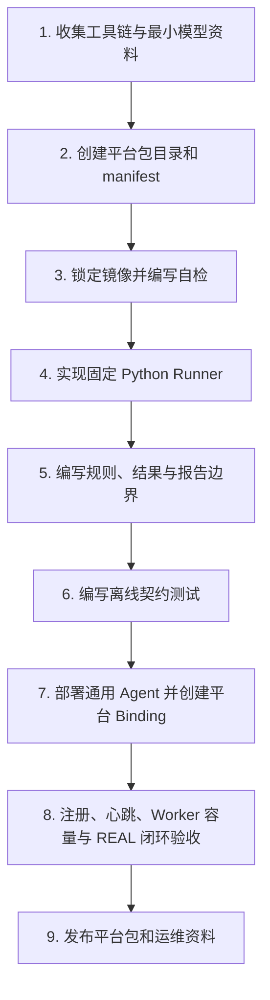

# 平台接入与扩展手册

> 接入人员可先使用仓库内的[平台接入与扩展套件](../../tools/platform_extension_kit/README.md)：它能够生成标准平台包骨架、提供受控脚本范例、执行离线契约检查并摘要调试结果。套件只解决“可重复的接入起点”，不替代厂商资料审查，也不代表平台已经具备编译、板端或 REAL 结论能力。

## 1. 目的与适用范围

本手册定义 X5、S100、Intel 等任一新平台如何接入 AI 方案评估与建议专家平台。它约束工具链容器化、镜像分发、统一执行协议、板卡连接、结果/证据上报和验收方式。

任何平台包未满足本手册，不得注册为可执行 REAL 平台。

Agent 的通用安装包、实例隔离域、目录组织及与控制面的交互方式，见
[Worker Agent 运行模型与隔离域说明](../operations/Worker-Agent运行模型与隔离域说明.md)。

### 1.1 平台目录生命周期与可评估条件

`platform_id` 由控制面的版本化 **PlatformCatalog** 提供，是已审核的平台包的稳定标识；
它不是 Docker 镜像名称，也不能由 Agent 自由填写。Agent 对本机 Docker 镜像的扫描只
能形成预筛对象，用于辅助接入，不构成真实平台能力或调度授权。

```text
Agent 发现受控标签/镜像摘要/工具版本
        ↓
候选镜像（仅证据，不能创建任务）
        ↓ 预筛通过
待接入平台 PENDING_INTEGRATION（评估页可见、不可选）
        ↓ 平台包、规则、镜像锁、Runner、自检、验收与人工审核完成
已接入平台 AVAILABLE（可建立 Agent 平台绑定）
        ↓ 存在在线 Binding 和 READY 槽位
评估页可选择并创建该平台任务
```

### 1.2 Candidate 多管理员协作

Candidate 是接入过程中的无期限人工独占工作项，不是第四种角色，也不是 Catalog/Binding/Worker 的运行租约。
创建 Candidate 后先处于未认领状态；管理员原子领取后才可编辑、测试和送审，所有写入均须携带当前
`If-Match` revision。不存在续租、倒计时、自然超时或自动释放。持有人主动释放、超级管理员带原因强制
释放，或超级管理员带原因“清理后指定管理员”时，控制面会清理本次接入的 Package、草稿、离线测试、
Candidate 验证任务及其临时 Evidence/Artifact；下一位管理员只能从新的干净工作包重新开始。指定目标必须
是 ACTIVE 管理员；超级管理员不能接管或转交进行中的材料。

| 目录状态 | 在评估页的行为 | 说明 |
|---|---|---|
| `PENDING_INTEGRATION` | 展示、禁用选择 | 正在接入；页面应展示接入进度或阻塞项。 |
| `AVAILABLE` | 条件性可选 | 仍须有在线 `PlatformBinding` 与 `READY` 容量。 |
| `REJECTED` | 展示、禁用选择 | 不支持或未通过安全、合规、技术审核，保留原因。 |
| `SUSPENDED` | 展示、禁用选择 | 曾可用但镜像、规则、健康或审核失效；保留历史。 |

平台的定义、宿主机纳管关系和任务执行实体必须分离：

```text
PlatformCatalog.platform_id
        ↓
PlatformBinding(agent_id, platform_id)
        ↓
Worker(agent_id, platform_id, worker_id)
        ↓
受控短时或可复用 Runner 容器
```

发现到来源不明、未带允许标签或无法验证摘要的镜像时，Agent 只能报告为不可纳管候选项；
不得自动执行、自动发布平台或把它加入评估可选列表。

## 2. 平台包目录与存放位置

源码仓库只保存可审查的定义、代码和小型测试资产；不保存 10G+ 工具链镜像、模型、日志或密钥。

```text
solution-advisor/
├── platform_packages/
│   └── x5/
│       ├── manifest.yaml              # 平台/能力/版本/镜像 digest
│       ├── docker/
│       │   ├── Dockerfile.runner      # 官方镜像的受控派生层；如无需派生则仅保留说明
│       │   ├── image.lock.yaml        # image、tag、digest、SHA256、兼容性
│       │   └── load-image.sh          # 首次部署/升级时加载，不在任务执行时调用
│       ├── runner/
│       │   ├── __main__.py
│       │   ├── static_check.py
│       │   ├── compile.py
│       │   └── schemas.py
│       ├── rules/                     # 支持性/风险/建议规则包
│       ├── reports/                   # 平台专有报告扩展
│       ├── tests/                     # Runner 契约、规则和解析测试
│       └── README.md
├── docs/operations/
│   ├── 部署手册.md
│   └── 备份恢复与数据保留策略.md
└── docs/records/
```

Worker 宿主机存放运行时与 Secret，不提交 Git：

```text
/opt/solution-advisor/worker-agent/              # Worker Agent 程序
/opt/solution-advisor/platform-packages/x5/      # X5 平台包与 Runner 版本
/etc/solution-advisor/workers/x5-a/config.yaml   # 非敏感 Worker Instance 配置
/var/lib/solution-advisor/worker/x5-a/work/      # 临时工作目录，可清理
/var/log/solution-advisor/worker/x5-a/           # Worker Agent 宿主机日志
/etc/solution-advisor/secrets/x5-a/              # 密码/私钥/令牌，0600
NAS 或内部 Registry：工具链 image tar / OCI archive、镜像校验文件
PostgreSQL / MinIO：模型、平台编译制品（X5 为 `model.bin`）、日志、PDF、Evidence 制品及元数据
```

`/opt` 只放程序与只读运行资源；实例配置必须置于 `/etc`，可清理任务数据必须置于 `/var/lib`，日志必须置于 `/var/log`。任何 Secret 均不得进入镜像、Git、数据库明文字段、普通配置文件或报告。

## 3. 工具链容器化规范

### 3.1 镜像不是任务输入

工具链镜像应预加载到指定 Worker 宿主机或由内部 Registry 拉取。任务创建时只引用 `platform_package_id + image digest`，不上传或重复加载镜像。

```text
NAS / Registry
  → 首次安装或升级：docker load / docker pull
  → Worker Host 本地 image cache
  → 每个任务：docker run 使用已存在的 image
```

### 3.2 三类接入方式

1. **官方 Docker 镜像**：固定厂商 tag 和 digest；必要时以 Dockerfile 添加平台 Runner，不能修改厂商工具链核心内容。
2. **工具包组合**：选择明确的 Base OS，使用 Dockerfile 安装包、设置环境变量和自检命令，构建内部派生镜像。
3. **遗留环境**：先将已验证的安装步骤 Dockerfile 化；未容器化的裸机环境只能作为迁移参考，不能成为长期 Worker 运行方式。

每个平台必须提供镜像自检：输出工具链版本、Runner 版本、关键命令存在性和最小离线 fixture 检查结果。

S100 3.7.0 的实际参考实现位于 `platform_packages/s100/`：固定 Runner 调用 `hb_compile`，产物 `.hbm` 标记为 `s100_hbm`。这不授权浏览器输入命令；真实验证仍只能由安装了该 Release 的 HostAgent 执行并回传 Evidence。

## 4. Runner 执行协议

平台 Runner 的输入不是用户刚上传的任意文件路径。控制面必须先完成 SHA256 去重，并由 `common-analyzer` 形成任务冻结的 Model Profile；平台 Runner 仅取得受控 Artifact 引用、SHA256、Profile 引用和固定评测配置。平台 Runner 不得重新生成或覆盖通用 Profile。

### 4.1 技术选型

- **对外接口：Python Runner。** 负责解析 JSON、参数校验、状态、日志摘要、结果和制品清单。
- **内部命令：Bash 可选。** 用于封装厂商 CLI、环境激活或多条命令串；必须由 Python Runner 调用，不能从控制面直接调用。

选择 Python 的原因是结果、异常、版本和证据必须标准化；只靠 Bash 很难稳定输出复杂 JSON 与错误语义。

### 4.2 调用上下文

Worker Agent 创建隔离目录并以最小权限启动工具链容器：

```text
/work/input/request.json       # 只读请求
/work/input/model.onnx         # 只读模型或受控下载缓存
/work/output/result.json       # Runner 输出
/work/output/artifacts/        # 平台编译制品、日志、诊断产物（X5 为 model.bin）
/run/secrets/...               # 只读 Secret；仅板端阶段挂载
```

标准调用：

```bash
python -m platform_runner execute \
  --request /work/input/request.json \
  --result /work/output/result.json
```

### 4.3 请求与结果

`request.json` 的关键字段：

```json
{
  "schema_version": "1.0",
  "task_id": "task_xxx",
  "subtask_id": "subtask_xxx",
  "capability": "static_check | compile | board_test",
  "model": {"artifact_uri": "...", "sha256": "..."},
  "model_profile_ref": {"id": "profile_xxx", "analyzer_version": "1.0.0"},
  "evaluation_config": {"input_shape": [1, 3, 640, 640]},
  "platform_package": {"id": "x5-standard", "version": "1.0.0", "image_digest": "sha256:..."},
  "deadline_at": "..."
}
```

`result.json` 必须包含：状态、阶段、公共结果、平台专有结果、标准原因码、Artifact/Evidence 声明和版本快照。Artifact 文件只有在 Worker Agent 完成 SHA256、上传对象存储并创建元数据后才视为有效。

## 5. 板卡连接、PlatformBinding 与 Worker

一个 `PlatformBinding` 表示“某 Agent 已被管理员授权管理某个已接入平台”，固定关联平台
包版本、受控 Runner 规则、实际选定镜像、能力和容量策略。Worker 是该 Binding 下由任务创建或复用的执行
实体；它的状态、租约、容器信息和任务 Attempt 都必须带有 `agent_id + platform_id`。
平台包本身或候选镜像不能直接成为 Worker。

跨 Host 复用的准入键是 **平台类型 + 版本 + 已审核 Runner 规则**。创建 Binding 时，管理员必须
显式选择目标 Host 已发现的一项镜像，作为“该镜像符合所选平台类型和版本”的管理确认。Catalog 中的
digest 是接入时的参考镜像指纹；目标镜像 digest 一致时记录 `MATCH`，不一致时记录
`VERSION_MATCH_DIGEST_DIFFERENT`、实际镜像引用和 digest，并在页面、审计、任务快照与 Evidence 中
提示和追溯，但不阻断 Binding/Worker。系统不会依据镜像名称或 digest 自动猜测平台、版本或命令。

板卡配置由管理员在 Worker Instance 页面维护，而不是由普通用户输入：

| 配置项 | 示例 | 敏感性 |
|---|---|---|
| 协议/驱动 | `ssh_password`、`ssh_private_key`、`adb_tcp`、`serial` | 非敏感 |
| 地址、端口、用户、目标目录 | `192.168.x.x:22`、`root`、`/data/models` | 非敏感但受 RBAC 保护 |
| 密码、私钥、令牌 | Secret Reference | 敏感；不存明文 |
| 能力 | `static_check`、`compile`、`board_test` | 非敏感 |

可用性验证 API 由 Worker 执行，例如：

```text
POST /api/v1/worker-instances/{id}/connectivity-check
```

它应返回脱敏结果：网络连通、认证状态、目标目录、设备/运行时版本、延迟和失败原因码。控制面 API 绝不直接持有或使用板卡凭据。

### 5.1 容量与繁忙状态

每个 PlatformBinding 必须配置同类工具链容器的 `max_concurrency`，并上报 Agent/Worker
健康状态、当前运行容器数、空闲槽位、队列数、心跳、镜像版本和最近脱敏错误。`BUSY`
仅表示健康但已达到并发上限；存在正在执行的容器但仍有槽位时，状态应为 `READY`。

Agent 取得任务时先原子保留容量。若当前所有容器均忙、但 `running_containers < max_concurrency`，Agent 可基于宿主机预加载镜像启动新的短时容器；若达到上限，任务保持排队。首期一任务一容器，完成即退出，禁止无边界复用。

### 5.2 Candidate、平台类型与 Catalog 标识

创建 Candidate 时，管理员选择已有的全局 `PlatformType`，或显式新建一个自定义类型，并登记该镜像的
目标版本。平台类型是可复用的全局资产；Catalog 审核阶段必须复用 Candidate 已冻结的类型和目标版本，
不得重新输入或改写为另一种平台。Catalog 的内部 `platform_id` 由 `PlatformType.name` 稳定派生，
其唯一版本键为 `(platform_id, version)`；审核者只可调整面向用户的显示名称和审核意见。

#### Candidate 接入工作区与真实验证门禁

Candidate 是接入工作区，不是一次“离线测试通过即已接入”的快捷开关。其第一步登记平台接入
档案和固定命令模板：编译命令与板端验证命令；这些是可编辑文本而非平台枚举下拉框。模板只能使用
`{model}`、`{profile_dir}` 等受管占位符，不能包含 Shell 串联、Docker、宿主机路径或凭据；不要求、也不
展示内部 Profile ID。接入档案说明只写长期平台事实，运行进度和阻塞项由系统的验证记录自动生成。
管理台按以下步骤引导，
每次配置修改都递增 Candidate revision，并使旧的离线检查和真实验证结果失效；页面必须按当前修订
持久化显示每一步的已完成、待执行、需要重做或受阻状态：

#### 系统授权占位符与固定命令模板

“固定编译命令模板”和“固定板端验证命令模板”标题旁的“系统授权占位符”链接会打开应用内说明页。
模板是平台级 Runner 契约，不是可从网页执行任意 Shell 的入口；固定 Runner 仅在任务运行时替换下表中的
受管值。

| 占位符 | 可用于 | 运行时替换值 |
| --- | --- | --- |
| `{model}` | 编译、板端验证，两个模板均必填 | 当前任务受管模型文件 |
| `{profile_dir}` | 板端验证（通常使用，可选） | 本次板端性能采集的受管 profile 输出目录 |

例如编译模板可为 `hb_compile --fast-perf --march nash-e --model {model}`，板端模板可为
`hrt_model_exec perf --model_file {model} --profile_path {profile_dir}`。模板的首个 token 必须是受控工具名；
系统拒绝 Shell 串联或重定向符号、Docker 调用、宿主机绝对路径、密码/令牌/私钥字样以及未列出的
占位符。保存任一模板都会使旧验证结果失效，必须重新执行离线检查和真实验证。

1. 查看持久化 Package 的受控文件结构，填写显示名、接入档案说明和结构化编译/板端规则；
2. 执行离线契约检查，只验证 Package、immutable digest 和固定 Runner 合同；
3. 通过已安装且审核过的固定真实 Runner 发起编译、制品和板端验证，持续记录进度、Artifact 与 Evidence；
4. 仅当当前 revision 的真实验证 `SUCCEEDED`，才可生成 `PENDING_INTEGRATION` Catalog；
5. 审核、发布为 `AVAILABLE` 后，才可建立 Binding 和 READY Worker，才是“已接入”。

同一平台类型的新版本若命令规则未变化，创建 Candidate 时可选择一个已发布的同类型 Catalog，
复制其已审核的结构化接入规则为新 Candidate 的步骤 1 草稿。复制只复用声明性规则，不复用旧
镜像、Package、Artifact、Evidence、审核或验证结论；新 Candidate 可编辑这些规则，任意保存
都会递增 revision，因而必须重新执行离线检查、真实验证和审核。历史 Catalog 若未保存结构化规则，
页面会明确提示只能从空白规则开始，系统不会猜测旧命令。

工作区按步骤分别提供离线契约检查和固定真实 Runner 验证入口。离线检查通过后，管理员才能发起
真实验证；真实 Runner 未安装或运行受阻则保留 `BLOCKED` Evidence，不能显示为“已验证”。

工作区 API 不接收 Shell、Docker 参数、宿主机路径或凭据；规则字段仅允许服务端的受控枚举。真实
验证启动时再选择 ONNX 文件，系统自动完成模型分析并生成内部 Profile。没有固定 Runner 时，真实
验证必须记录为 `BLOCKED` 并说明阻塞项，绝不能伪造编译或板端成功。Workbench
也只能把 `AVAILABLE` Catalog 显示在“已接入”；待审核 Catalog 仍留在“接入中”。

对历史上在真实验证机制落地前被错误发布的 Catalog，只有超级管理员可以填写原因后将其撤回到
`PENDING_INTEGRATION` 并恢复关联 Candidate 工作区。该操作保留 Package、Artifact、Evidence、
Catalog、CandidateHistory 和 PlatformAudit；若已存在 Binding 则拒绝撤回，避免破坏已经授权的执行链。

管理接口至少应提供：

```text
GET /api/admin/worker-instances
GET /api/admin/worker-instances/{instance_id}/capacity
GET /api/admin/worker-instances/{instance_id}/health
```

## 6. 与 common-analyzer 的边界

### 5.2 M4-B-R0 的既有 X5 单平台板端边界

M4-B-R0 使用现有 `x5-a` Worker Agent 和固定 X5 平台包完成板端预检、受控制品下发与
固定 Runtime 调用。任务类型为 `REAL_BOARD_SMOKE`，仅管理员可创建，且必须引用 M4-A
成功任务登记的 `compiled_model_artifact / x5_bin / model.bin`；控制面不接受板卡地址、
凭据、SSH 命令、Docker 参数、主机路径或 Runtime 命令。

本轮固定 Runtime 调用和板端 Profile 都由 Agent Host 的受保护配置决定。Evidence 记录
预检、加载说明、Runtime 日志、profile 文件和结果对象的 SHA256；从原始 profile 解析 FPS、
Latency、运行条件和分段耗时写入报告时必须同时保留解析器版本。CPU 时间段不能直接表述为
模型 CPU 算子，模型算子落点以编译日志分配为准。加载与 Runtime 执行在 `hrt_model_exec perf`
中不可拆分时必须记为 `NOT_SEPARABLE_BY_RUNTIME_COMMAND`，而不能伪造独立加载成功。精度、稳定性、功耗
和推荐部署始终为 `NOT_VERIFIED`。

M4-C-R1 已将此分层落地为控制面的 `PlatformCatalog → PlatformBinding → PlatformWorker`。
Agent 只读上报候选镜像与工具版本，管理员才能把候选置为待接入、审核发布 Catalog 和创建
Binding；Worker 由健康 Binding 创建或复用，Runner 使用 Catalog 锁定的规则及 Binding 实际选定的
Host 镜像。暂停
Catalog 或 Binding 阻止新任务，不删除历史任务、制品或 Evidence。

`common-analyzer` 是平台最小系统的通用 Worker，不属于任何平台包。它负责 ONNX 基础 Profile、通用模块化分析和版本化配置快照；即使尚未安装 X5/S100/Intel 平台包也必须可运行。

平台包只能在 `common-analyzer` 成功生成或复用 Model Profile 后运行。通用分析模块可由管理员配置启停、参数、依赖和并发上限，但只能配置镜像内已安装、已审查的模块，禁止用户或管理员上传任意脚本。每个任务必须冻结分析器配置快照。

## 7. 平台扩展人员接入一个新平台的实际流程

本节面向“要把 J6M、S100 或其他新平台接入系统”的平台扩展人员。目标不是复制
X5 代码，而是在不改动控制面和 `common-analyzer` 的前提下，交付一个可审查、可测试、
可部署的平台包与至少一个可运行 Agent 实例。

### 7.1 先确认输入资料是否齐全

以下资料不齐时可以编写文档和目录骨架，但不能宣称该平台具备 REAL 能力：

| 资料类别 | 最少需要的资料 | 用在什么步骤 | 缺失的影响 |
|---|---|---|---|
| 平台身份 | 平台 ID、显示名称、支持范围、联系人 | `manifest.yaml`、页面显示 | 平台没有稳定身份，不能注册 |
| 工具链 | 官方镜像或可复现 Dockerfile、版本、OS/架构、许可约束 | `image.lock.yaml`、自检 | 无法证明执行环境，禁止启用 compile |
| 工具命令 | 厂商 CLI 的固定调用方式、输入/输出约束、退出码 | Python Runner | 不能实现受控执行入口 |
| 产物语义 | 真实产物名称/格式、大小和校验方式 | Artifact/Evidence、报告 | 容易把 `.bin`、HBM 等平台制品混淆 |
| 最小模型 | 可公开/可提交的离线 ONNX fixture、生成脚本、预期结果 | Runner 测试、CI | 无法离线回归或镜像自检 |
| 规则知识 | 支持性限制、风险规则、日志关键字、证据等级 | `rules/`、报告 | 可先不做规则，但不得伪造规则结论 |
| Worker Host | Docker、镜像预加载、磁盘/权限、到控制面的网络 | 实例部署 | 平台包可开发但无法实际执行 |
| Secret 策略 | Agent 注册 Token 的来源、轮换方式和权限责任人 | Host 实例配置 | 不能安全注册 Agent |

板卡地址、SSH 密钥、性能阈值不属于 M4-A 的前置资料；它们只在 M4-B 的
`board_test` 接入时由受控 Secret/连接方案提供。

### 7.2 接入步骤



#### 步骤 1：建立平台接入档案

收集上表资料，明确本阶段只声明哪些能力，例如 `[static_check, compile]`。同时写下
不能声明的能力，例如没有板卡证据时不得声明 `board_test`。产出一份接入记录，作为
后续评审的输入。

#### 步骤 2：创建平台包骨架

创建 `platform_packages/<platform-id>/`，至少含 `README.md`、`manifest.yaml`、
`docker/image.lock.yaml`、`runner/`、`rules/`、`reports/` 和 `tests/`。从 X5 目录学习
结构可以，但必须替换平台 ID、版本、制品语义与工具链事实；不能把 X5 规则复制后当作
新平台结论。

输入是平台身份与能力范围；产出是可审查的目录和 manifest。此时控制面仍不会自动把
平台标为可用，因为尚无健康 Agent 和 Runner 验证。

#### 步骤 3：锁定工具链镜像

在 `image.lock.yaml` 记录镜像引用、Image ID/digest（可得时）、OS/架构、Python、
厂商工具版本和只读自检命令。由 Worker Host 管理员预加载或从内部 Registry 获取镜像；
任务运行阶段不得 `docker load` 或从用户输入决定镜像。

产出是“哪一个工具链环境被允许运行”的可审查事实。若自检版本与 lock 不一致，实例
必须是 `DEGRADED`/`OFFLINE`，不能提供 `compile`。

#### 步骤 4：实现唯一固定 Runner

实现：

```bash
python -m platform_runner execute --request /work/input/request.json --result /work/output/result.json
```

Runner 必须校验 schema、模型 SHA256、Profile 引用、平台包和规则版本；只调用固定的
厂商 CLI。它输出结构化 `result.json`、原因码、制品和 Evidence 声明。平台扩展人员
不得让控制面、Web 或 Agent 直接接收 Shell、Docker 参数或任意宿主机路径。

#### 步骤 5：定义证据与报告边界

为每个真实输出定义 Artifact 类型、平台格式、Evidence 类型、SHA256 与阶段。例如 X5
定义 `compiled_model_artifact / x5_bin / model.bin`。报告同时列出已发生的编译事实和
未验证项；未做板端测试时必须明确 `board_validation=NOT_EXECUTED`，不能使用“已实测”
或交付性部署结论。

#### 步骤 6：编写离线测试

至少覆盖：manifest/image lock、Runner 请求/结果、SHA256 不匹配、静态检查成功/失败、
编译成功/失败/超时的结构化结果，以及制品/Evidence 语义。测试不能要求外网、真实
板卡或固定 Host 路径。此步骤产出 CI 可运行的契约测试和最小 fixture。

#### 步骤 7：部署通用 Agent 并创建平台 Binding

平台扩展人员提供平台包；Worker Host 管理员安装并启动通用 Agent wheel，创建例如
`agent-host-01` 的 Host 身份、控制面地址、专用 Token 和受控镜像扫描范围。随后仅对
已发布为 `AVAILABLE` 的 J6M 平台，在管理端创建
`PlatformBinding(agent-host-01, j6m)`，绑定锁定镜像、平台包版本、能力和并发策略。
详细目录和运行模型见前述 Agent 专题文档。

这里的 `j6m` 是平台目录中的平台 ID，`agent-host-01 + j6m` 是一个长期纳管关系，均
不是 Worker。每个任务由 Agent 在该 Binding 下动态启动或复用 Worker/短时任务执行
容器；任务容器不是 Agent，也不是平台本身。

#### 步骤 8：做控制面闭环验收

确认 Agent 在线、Binding 已纳管、至少一个 Worker 为 `READY`，管理页可看见镜像/版本/
能力/容量；管理员可创建受控 REAL 任务，Agent 可 claim、取得 PostgreSQL 租约、执行
固定 Runner、上传 Evidence、释放租约，任务页和 PDF 能显示事实与未验证边界。只有这
一闭环通过，才可对外声明该平台支持已验收的能力范围。

#### 步骤 9：发布与维护

发布版本化平台包、镜像锁、Agent 配置模板、Binding 策略、升级/回滚说明和验收记录。
后续升级镜像、Runner、规则或产物格式时提升平台包版本，并让新任务冻结新快照；不可
原地改写历史任务的环境事实。

### 7.3 接入完成的交付清单

平台扩展人员应交付：

1. 版本化 `platform_packages/<platform-id>/`；
2. 镜像锁、自检记录及最小 fixture；
3. Runner、规则、结果/Evidence/报告边界；
4. 离线自动化测试与真实 Host 验收记录；
5. Agent 配置模板、PlatformBinding 策略和部署说明（不含 Token）；
6. 已支持与明确未支持能力的清单。

## 8. 平台接入验收

### 8.1 配置草稿与容量租约（R2）

管理端先创建持久化草稿，再编辑、校验、发布或丢弃；草稿不能被 Worker 读取。发布以草稿基线版本进行乐观并发检查，冲突会被拒绝并审计。回滚也是“由历史版本创建草稿并发布”的新版本，绝不原地覆盖历史。

所有 Worker（含未来 X5 Agent）使用同一 PostgreSQL 容量租约：先在事务内占用唯一槽位，再启动受控执行器；完成、失败、取消可幂等释放，心跳中断后恢复器回收超时租约。租约不包含命令、凭据或平台机密。

1. 镜像可按清单加载，digest 与 manifest 匹配；
2. Runner 契约测试可在无板卡环境通过；
3. 静态检查/编译能产生结构化 result 和 Artifact/Evidence；
4. REAL 权限、Worker 身份和任务租约通过控制面校验；
5. 有板卡时，通过管理员 UI 的可用性验证后才允许 `board_test`；
6. 平台专有字段不改变公共 Result Schema；
7. 镜像升级、规则升级和 Runner 升级均保留版本快照并可回归。

### 8.2 X5 标准性能预设

管理员在执行资源页选择已成功的 X5 编译任务，启动“标准性能预设”。它只引用登记的 `model.bin`，由 HostAgent 执行固定 `hrt_model_exec perf` 并上传原始 profile Evidence；不接收用户填写的命令、地址、路径或凭据。报告展示 FPS、平均延迟、运行条件、分段耗时、编译分配与性能建议；建议只能作为后续优化动作，不能表示精度、稳定性、功耗或部署已验证。

### 8.3 评估任务的平台选择与生命周期

用户页面不提供 DEMO 任务创建入口。创建评估时，前端只消费后端
`GET /api/v1/evaluation-platforms` 返回的平台 ViewModel，并将每个平台显示为：

平台的运行唯一性为 `(platform_id, version)`；每个 Catalog 版本锁定自己的 Runner 和命令契约，并保留
接入时参考镜像 digest 供追溯。页面按 `platform_id` 聚合，同一平台的多个版本使用互斥单选，
默认选中可用版本中版本号最高的一项；不同平台组仍可同时选择。

`PlatformType` 是控制中心的全局资产。创建 Candidate 时管理员必须选择已有类型，或选择
“自定义”输入新名称，并填写目标版本；新名称会持久化为后续 Candidate 可复用的类型。Candidate
只保存客户声明，审核 Catalog 时默认继承其类型与版本并再次执行唯一性和 Evidence 校验。

Candidate 的 Package ID 是受控测试包、Artifact 和 Evidence 的内部关联标识，不是客户需要
命名的平台资产。管理台默认按照 `平台类型-目标版本-镜像digest短码` 自动生成，并在创建前展示
预览；管理员仅可在“高级选项”中覆盖它。覆盖值必须为小写受限标识，且不会改变 Catalog 的
平台类型、版本或 immutable digest。

| 状态 | 含义 | 页面行为 |
| --- | --- | --- |
| 可用、已选中 | 已发布 Catalog、健康 Binding、在线 HostAgent、READY Worker 且存在可执行 Runner | 可取消勾选 |
| 可用、未选中 | 同上，但用户未选择 | 可勾选 |
| 不可用 | 接入中、未发布、暂停、Agent/Worker 不健康，或尚无可执行 Runner | 禁用并展示原因 |

镜像发现和 Candidate 不构成可用平台。X5 与已发布的 S100 Release 均可具备独立执行链；Intel
等尚未发布平台可出现在列表中，但在交付真实 Runner、受控执行协议和验收证据前必须为不可用。即使
Catalog、Binding 和 Worker 均显示可调度，用户 Flow 的板端实测失败也必须如实汇总为失败，不能由旧
Candidate Evidence 或其他用户的成功结果替代。

一次用户可见的 `EvaluationFlow` 对每个所选平台自动串联两阶段：X5 为
`X5_COMPILE → REAL_BOARD_SMOKE`，S100 为 `S100_COMPILE → S100_BOARD_PERF`。编译阶段分别生成
受控 `model.bin / x5_bin` 或 `.hbm / s100_hbm`，成功后系统自动排队固定 `hrt_model_exec perf` 板端阶段；
用户不创建、不填写第二阶段的命令、路径、凭据或 Docker 参数。

调度以 Flow 冻结快照为准：每个平台阶段只能由其创建时指定的 Binding、Worker 和 Runner Release 领取，
不得跨平台、跨 Flow 或跨 Worker 复用制品与 Evidence。编译使用 Binding 的 `max_concurrency` 槽位并行运行；
每个槽位对应一个任务期固定 Runner 容器和一条容量租约。板端性能阶段则按 **同一 Binding 串行**，以避免
同一板卡争用；不同 Binding 的板端阶段可并行。编译任务成功后只自动引用同一 Flow、同一平台、同一编译
阶段登记 SHA256 的制品。

编译任务和板端性能任务是两条受控执行记录：编译报告显示自动板端阶段的中文状态，并在已创建
时链接到板端性能报告；性能事实只在后者及其 PDF 中展示。若编译完成瞬间 Binding、Worker 或
板端能力不满足入队条件，编译事实仍保留，页面会明确显示“未执行”及原因，不得伪装为性能失败
或成功。

编译阶段结束但自动板端阶段仍处于等待、认领或执行中时，编译报告页继续每 5 秒局部刷新该阶段
状态；用户无需手动刷新页面。页面和 PDF 将内部状态码显示为中文，原始状态码仍保留在 Evidence
和 API 数据中用于审计与程序集成。

模型详情的“评估报告”列表只显示用户创建的评估流程入口；自动创建的编译、板端性能等内部阶段
不会另占一条评估记录。入口详情显示各阶段状态，并在需要时链接至对应阶段的证据记录。

流程入口的进度必须按当前阶段汇总：编译未结束时显示编译状态；编译成功后显示板端阶段的等待、
执行、成功、失败、取消或超时；板端未能入队时显示“编译完成，板端性能未执行”及保留的原因。
每个阶段继续独立保存状态、错误码、Artifact 和 Evidence，流程视图只负责面向用户汇总，不丢失
中途退出或失败的事实。

多个 Flow 可以同时进入系统：每个 Flow 的选中平台、快照、内部阶段、租约、Artifact、Evidence、取消、
超时、重试和最终报告互相独立。某平台失败不会终止同一 Flow 的其他平台，也不会影响其他 Flow；只有所有
所选平台的最后阶段成功，Flow 才显示成功。一个成功、另一个失败时显示“部分成功”；编译成功而板端仍在
等待或运行时不得显示整体成功。Worker 离线、DRAINING、能力不符或槽位耗尽时，任务保持等待或按规则
超时/失败并记录原因，绝不静默改投其他 Worker。

### 8.4 S100 接入就绪基线（M5-A-R0）

S100 在 M5-A-R0 截止时只是“已发现的候选工具链镜像 + 已授权板端”的接入准备对象，不是已发布的
`platform_id`，也不是可调度平台。脱敏发现 Evidence 见
`docs/records/evidence/M5-A-R0-S100-discovery-sanitized.json`：其中记录了候选镜像的
immutable digest、创建时间、`linux/amd64` 环境和 Python 版本，以及已授权板端的 S100 型号、
`aarch64`、OS 与 BPU 设备节点摘要；不记录地址、账户、密码、Token 或敏感路径。

发现探测本身未识别可执行的 S100 SDK、Runtime 包、官方离线示例或模型产物格式。平台提供方随后
声明候选编译入口为固定 `hb_compile --fast-perf --march nash-e --model <input_onnx>`，板端性能入口为
`hrt_model_exec perf`；两者已写入 `NOT_READY` 模板，状态均为 `DECLARED_NOT_VERIFIED`。M5-A-R1
必须在锁定镜像与已授权板端实际自检、记录版本和原始 Evidence 后才能使用。不得因命令名称与 X5
相同而复用 X5 的产物格式、profile 解析、性能数值或可用性结论。
`docs/operations/s100-worker-template.yaml` 是 `NOT_READY` 契约模板，明确保留待确认的
Runner 输入/输出、编译产物、Runtime、许可、离线 fixture、容量与健康检查字段；它不是 Agent
运行配置，不能创建 Candidate、Catalog、Binding、Worker 或用户可选平台。

本段仅记录 M5-A-R0 的历史起点。后续 R2 已完成固定 Runner 的系统验证和发布；R2-R1 的当前可调度
Release 为 `S100 / 3.7.0-r1`。进入 S100 后续接入前，仍必须依次完成：交付并审核版本化 Platform Package、锁定参考
镜像 digest、确认厂商许可和官方离线 ONNX fixture、实现固定 Runner 与自检、
保留离线测试 Evidence，并由审核发布的 PlatformCatalog 分配正式 `platform_id`。随后才可为
发现可用于该平台版本且经管理员确认规则的 Host 创建 Binding 与 READY Worker；digest 不同会告警并保留
实际执行追溯，但不阻断版本/规则复用。后续用户体验可以复用一次评估到内部独立
阶段的自动串联、状态汇总、Artifact/Evidence、权限、审计、报告和 PDF；不得复用 X5 的
`hb_mapper`、`model.bin`、`hrt_model_exec`、性能解析器或数值。

删除 X5 评估时，只有编译和自动板端阶段均处于终态（成功、失败、取消或超时）才允许。
控制面在同一事务中删除两个阶段的任务、结果、分享、任务审计、Evidence、快照和仅被这些
阶段引用的 Artifact/对象存储内容；原始 ONNX、通用 Profile、其他评估以及 Catalog、Binding、
Worker 不受影响。任一阶段仍在排队或运行时必须拒绝删除。
# S100 真实验证门禁（M5-A-R2）

S100 的 Candidate 离线检查只验证资料契约。管理员发起“真实验证”后，由受保护 HostAgent 执行固定 Runner；成功结果绑定当前 Candidate revision。编辑资料会使旧结果失效。人工命令输出、人工 `.hbm` 和人工性能记录只能作为研发参考，不能进入发布门禁。

## Candidate 阶段引导（M5-C-R1-R1）

平台工作台按 Candidate 的三态提供上下文引导，而非把接入过程当成单次“测试通过”操作：

1. **发现镜像**：仅说明 HostAgent 的只读发现事实；管理员填写平台类型、目标版本和接入档案后才能创建 Candidate，系统不会在此创建 Binding、Worker 或用户可选平台。
2. **人工接入中**：明确当前认领人、只读/可编辑权限和三步顺序：资料与固定规则、离线契约、真实接入验证。修改规则会使旧验证失效；认领人释放或超级管理员强制释放时先清理该次资料、临时任务和临时 Evidence，绝不直接移交给下一管理员。
3. **已发布平台**：说明 Catalog 仍需健康 Binding、在线 HostAgent、READY Worker、固定 Runner 与镜像校验才可调度；发布资料和审计可追溯，但普通用户报告只读取自己的 Flow 快照。

页面引导可以链接到固定 Runner 规范和受控占位符帮助，但不能成为任意 Shell、Docker 参数、Host 路径、凭据或 Runner 编辑入口。
