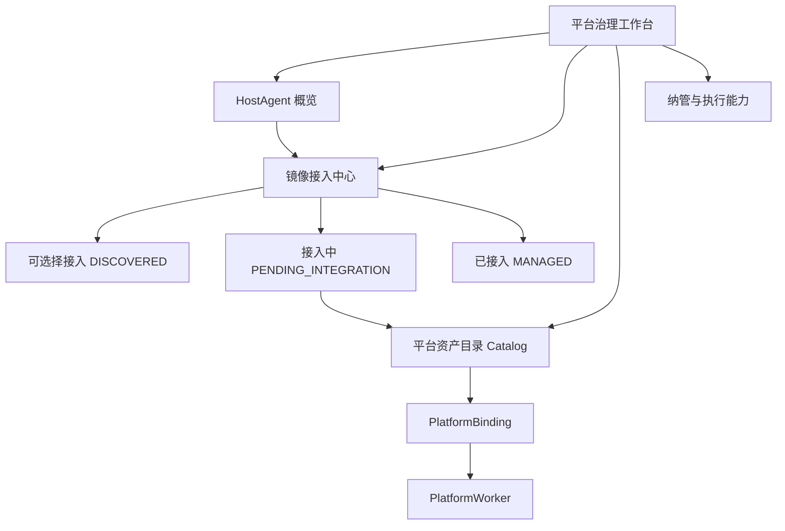
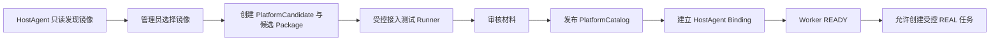

# 平台治理工作台设计

## 目标

平台治理工作台是管理员完成平台接入、审核、纳管与运行观察的统一入口。它以
`PlatformCatalog` 为中心平台资产，以 `HostAgent → PlatformBinding → PlatformWorker → Runner`
为承载和执行链路；不以某一台服务器或镜像 tag 作为平台身份。

## 信息架构

## 业务流程

## 页面分区与状态

| 分区 | 主要内容 | 颜色/图标 | 允许动作 |
| --- | --- | --- | --- |
| HostAgent 概览 | 在线、心跳、发现镜像数、Binding/Worker 数 | 状态文字与颜色 | 查看，不执行任意命令 |
| 可选择接入 | `HostImage / DISCOVERED` | 灰蓝 `○` | 创建 PlatformCandidate |
| 接入中 | `PlatformCandidate / PENDING_INTEGRATION` | 琥珀 `◐` | 查看 Package、测试、审核缺项 |
| 已接入 | 镜像 digest 已关联 Catalog | 绿色 `●` | 查看 Catalog、Binding、Worker；暂停或升级 |
| 执行能力 | Binding/Worker/容量/队列/错误 | READY/BUSY/OFFLINE 等 | 观察、受控纳管；无危险容器操作 |

颜色只表达状态；后端仍是唯一权限与可调度性判定来源。

## 跨 Host 复用

Catalog 是全局平台资产。A 上某镜像完成适配并发布 Catalog 后，B 若发现相同 immutable digest，
只需创建自己的 Binding 和 Worker 即可复用；B 未发现该 digest 时后端必须拒绝 Binding。

## 验收标准

1. 管理页不展示原始 JSON；1280px 桌面宽度下分区清晰。
2. 三类镜像独立分组，状态文字、图标、颜色和下一步动作一致。
3. 纯镜像只能创建 Candidate；Candidate/未发布 Catalog 均不能创建 REAL。
4. 已接入镜像能显示其 Catalog、Binding、Worker 与容量关系。
5. Token 不出现在 URL、localStorage、页面文本或日志。
