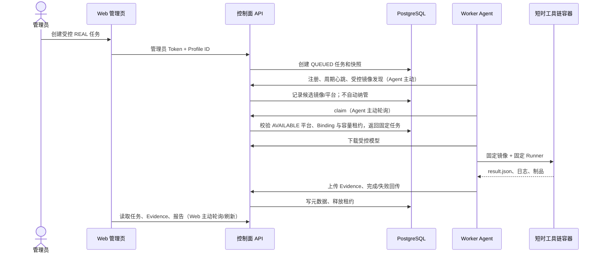

# Worker Agent 运行模型与隔离域说明

## 1. 一句话定义

**Worker Host** 是安装 Docker 和平台工具链镜像的执行服务器；**Worker Agent** 是该
服务器上的常驻通用 Python 进程；每个评估任务由 Agent 启动一个短时、隔离的工具链
容器执行。三者不是同一个概念。

目标部署是“一台 Host 一个 Agent”，Agent 启动后保持常驻并主动注册、心跳、扫描受控
Docker 清单和汇报运行状态。多 Agent 仅用于确有安全域隔离、不同控制面或独立宿主机
权限边界的场景；它不是为了区分 X5、J6M 等平台。

```text
Worker Host
└── Agent agent-host-01              # 常驻 systemd 服务，一个 Host 的身份
    ├── PlatformBinding：x5           # 已纳管平台能力与镜像/容量策略
    │   └── Worker：x5-w-001          # 动态创建或复用的执行实例/短时容器
    ├── PlatformBinding：j6m          # 同一 Agent 可纳管的另一平台
    │   └── Worker：j6m-w-001
    └── 候选镜像清单                  # 仅预筛，不可调度
```

## 1.1 平台目录、纳管绑定和 Worker 的关系

`platform_id` 只能来自控制面已发布的 **PlatformCatalog（平台目录）**，而不是 Agent
上报的自由文本或任意 Docker 镜像名称。Agent 的发现结果只是候选证据；控制面审核完成
平台包后，才允许该 ID 进入目录并被纳管。

```text
PlatformCatalog.platform_id（已接入的平台定义）
        ↓
PlatformBinding(agent_id, platform_id)（某台 Host 已纳管该平台）
        ↓
Worker(agent_id, platform_id, worker_id)（任务执行实例）
        ↓
短时或可复用的受控 Runner 容器
```

平台状态与可调度性应严格分离：

| 平台目录状态 | 评估页面 | 含义 |
|---|---|---|
| `PENDING_INTEGRATION` | 可见但不可选 | 候选镜像预筛通过，平台包/验证正在接入。 |
| `AVAILABLE` | 满足容量条件时可选 | 平台包已审核发布，可创建 Agent 平台绑定。 |
| `REJECTED` | 可见但不可选 | 不支持或未通过安全、合规、技术审核。 |
| `SUSPENDED` | 可见但不可选 | 曾经可用，现因镜像、规则或健康审核失效而暂停。 |

即使为 `AVAILABLE`，仍只有至少一个在线 `PlatformBinding` 和一个 `READY` Worker
槽位时，评估页面才允许创建该平台任务。

## 2. Agent 的功能、形态和依赖

Agent 是 Python 通用安装包，入口为：

```bash
solution-advisor-worker-agent --config /etc/solution-advisor/workers/x5-a/config.yaml
```

生产建议由 `systemd` 常驻运行；开发/验收可加 `--once`，领取至多一个任务后退出。
它本身不包含 X5、J6M 等任何厂商工具链、算子规则、镜像或板卡逻辑。

| Agent 负责 | Agent 不负责 |
|---|---|
| 注册、心跳、领取受控任务 | 接受用户 Shell、Docker 参数或宿主机路径 |
| 只读扫描受控镜像标签、摘要与工具版本，汇报候选项 | 将任意发现的镜像自动纳管或自动执行 |
| 下载控制面授权的 ONNX | 通用 ONNX Model Profile 分析 |
| 建立独立临时目录、启动固定 Runner | 直接连接 PostgreSQL、Redis、MinIO |
| 上传 Artifact/Evidence、完成/失败回传 | 保存 Token 到数据库、日志、页面或 URL |
| 周期心跳和任务租约续期 | 板卡 SSH、性能/精度/稳定性测试（M4-A） |

Host 必备依赖是：受支持的 Linux、Docker CLI/daemon、通用 Agent wheel、对应平台包、
已预加载的锁定工具链镜像，以及到控制面 Web/API 的 HTTPS 网络连通性。Agent 不需要
控制面数据库、Redis 或 MinIO 的网络权限。

## 3. “通用安装包是否需要配置”与隔离域

需要。安装包只提供公共行为；**Agent 配置才把它变成某个可运行 Agent**。平台差异则
由控制面中的 `PlatformBinding(agent_id, platform_id)` 和已发布平台包共同定义。

不配置时，Agent 不知道：自己是谁、控制面在哪里、从哪个受限文件读取 Token、允许扫描
哪些 Docker 标签/命名空间以及本地工作目录，因此不能启动。它不应靠本地自由配置把
未审核的平台或镜像变成可调度能力。

隔离域以“Agent 实例配置”为单位，而不是以 Python wheel 为单位。隔离一个不同环境时，
不要复制 Agent 源码；创建一套独立实例配置即可。

| 隔离需求 | 必须独立的配置项 |
|---|---|
| 不同平台，例如 X5 / J6M | `PlatformBinding`、平台包版本、镜像锁、能力和容量策略 |
| 相同平台的不同工具链版本 | 独立 Binding 版本、镜像 ID、平台包/规则版本与工作目录策略 |
| 开发 / 测试 / 生产 | 控制面 URL、专用 Token 文件、工作目录、日志目录、并发上限 |
| 不同客户或安全域 | 独立 Host 或至少独立实例 ID、Token、存储访问策略和审计边界 |

同一隔离域内的多个并行编译不是多个 Agent：每个 `PlatformBinding` 设置
`max_concurrency`，由控制面 PostgreSQL 租约限制该平台在该 Agent 上可并行启动的
短时容器数量。Agent 配置先登记自身的执行上限，Binding 只能授予其不大于该上限的容量；管理页将
HostAgent 与其动态 PlatformWorker 的租约聚合展示，不能把正在运行的平台容器显示为空闲。

## 4. 正常运行的配置单元与目录组织

一个“正常运行配置单元”是：**一个 Agent 进程、一份 Agent 配置、一个专用 Token 文件
和一个受控工作目录**。一个或多个平台能力由控制面保存的 `PlatformBinding` 绑定到这个
Agent；Worker 则在该 Binding 下按任务创建或复用。

```text
/opt/solution-advisor/
├── worker-agent/                         # 通用 wheel/虚拟环境；可被多个实例复用
└── platform-packages/
    ├── x5/                                # 只读、版本化平台包
    └── j6m/                               # 可选的另一平台包

/etc/solution-advisor/
├── agents/
│   └── agent-host-01/config.yaml           # 非敏感 Agent 配置
└── secrets/
    └── agent-host-01/registration-token    # 0600；只属于该 Agent

/var/lib/solution-advisor/worker/
└── agent-host-01/work/                    # 每任务创建独立临时目录

/var/log/solution-advisor/worker/
└── agent-host-01/
```

示例配置（不含任何真实 Token）：

```yaml
agent_id: agent-host-01
control_plane_url: https://advisor.example.internal
registration_token_file: /etc/solution-advisor/secrets/agent-host-01/registration-token
work_root: /var/lib/solution-advisor/worker/agent-host-01/work
managed_image_label: io.solution-advisor.platform
heartbeat_interval_seconds: 15
```

配置不能包含用户命令、Docker 挂载、任意网络参数、板卡地址、密码或私钥。平台包、
镜像锁、`PlatformBinding` 和服务端校验共同限制可执行内容。

> 当前 M4-A 已实现的是“一份 Agent 配置对应一个 X5 平台实例”的最小形态。这里定义
> 的“单 Agent 多 Binding”是后续管理面和 Agent 协议的目标收口；在其落地前，不能把
> 文档中的目标字段误认为当前 API 已支持的配置格式。

## 5. Agent 与管理端如何交互

这里的“管理端”实际分为两层：管理员使用 Web 管理页面；控制面 FastAPI 才是 Agent
的通信对象。管理员不会直接向 Agent 发送 Shell 或 Docker 命令。



### 谁主动、谁被动

- **Agent 主动发现控制面**：从 `control_plane_url` 读取地址，使用 Token 发起注册、
  心跳与 claim。控制面不需要也不应扫描 Host、反向 SSH 或主动连接 Agent。
- **控制面被动响应并拥有裁决权**：校验 Token、实例身份、能力、平台包、容量租约和
  任务状态；只有通过校验才返回任务或接收 Evidence。
- **管理员主动操作 Web**：创建/取消/重试任务、查看状态；Web 只请求控制面 API，
  不直连 Agent。

当前 Agent 以短轮询 claim 工作；Redis 可用于控制面内部通知，但 PostgreSQL 仍是任务
状态和容量租约的事实来源。Worker Host 不必、也不应暴露 Redis 到公网。

## 6. 发现、启动与故障恢复

控制面通过 Agent 的注册和心跳发现 Host；Agent 还可以只读扫描带受控标签的本地镜像，
上报镜像摘要、标签、工具版本与发现时间。扫描结果首先是“候选镜像”，不能自动变成
`platform_id`、PlatformBinding 或可执行 Worker。

候选镜像预筛通过后，管理端可创建“待接入平台”记录并跳转到平台接入与扩展套件；完成
平台包、规则、镜像锁、Runner、自检和人工审核后才发布为 `AVAILABLE`。随后管理员才可
创建 `PlatformBinding(agent_id, platform_id)`；该 Binding 下的 Worker 显示 `READY`、
`BUSY`、`OFFLINE` 或 `DEGRADED`。心跳超时后 Agent 与其 Worker 显示 `OFFLINE`；重新
启动同一 Agent 配置会重新注册并恢复可见。

建议 systemd 单元使用 `Restart=on-failure`，确保控制面短暂重启、网络恢复或 Agent
进程异常退出后自动重试。每次启动前 Agent 会再次注册，镜像/版本/能力改变也会由
控制面记录。不要通过删除数据库记录或手工修改租约来“修复”容量；应让租约到期回收
或由受控取消/重试接口处理。

## 7. M4-A 边界

当前 Agent 仅支持 X5 静态检查和编译。它可以证明锁定环境中的 `model.bin` 编译成功，
但不能证明板端可运行，也不会产生性能、精度、稳定性或交付性部署结论。候选镜像扫描、
待接入平台目录、单 Agent 多 PlatformBinding 与动态 Worker 管理是后续收口，不应被
误写成已完成能力。板卡 Secret、连接、板端命令与性能 Evidence 属于 M4-B。

## 运行时可用性与评估

用户选择平台不是镜像枚举，也不是前端固定开关。控制面仅在 `Catalog=AVAILABLE`、Binding
为 `HEALTHY`、HostAgent 在线、且存在 `READY` Worker 时，将该平台作为“可用”返回。正在
接入的 Candidate、待审核 Catalog、暂停 Catalog 或没有可执行 Runner 的平台必须显示为不可用。

X5 的评估由 Agent 自动领取两个受控阶段：编译阶段可在已验收的多个槽位中并行；编译成功后，控制面
自动创建板端性能任务。第二阶段固定使用前一阶段登记的 `model.bin` 和固定 `hrt_model_exec perf`
预设，并且同一动态 Worker 同时仅允许一个板端任务。该内部拆分用于权限、租约、Evidence、失败恢复和
板卡互斥，不要求用户在页面上创建第二个任务。
