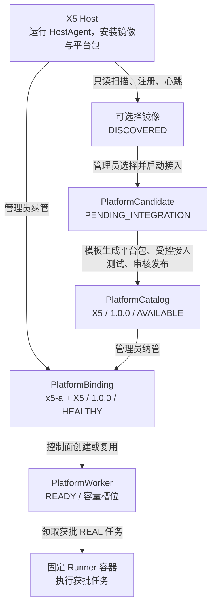
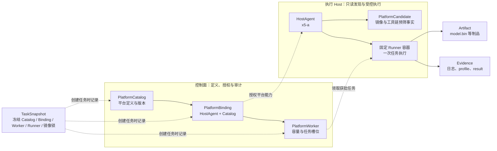
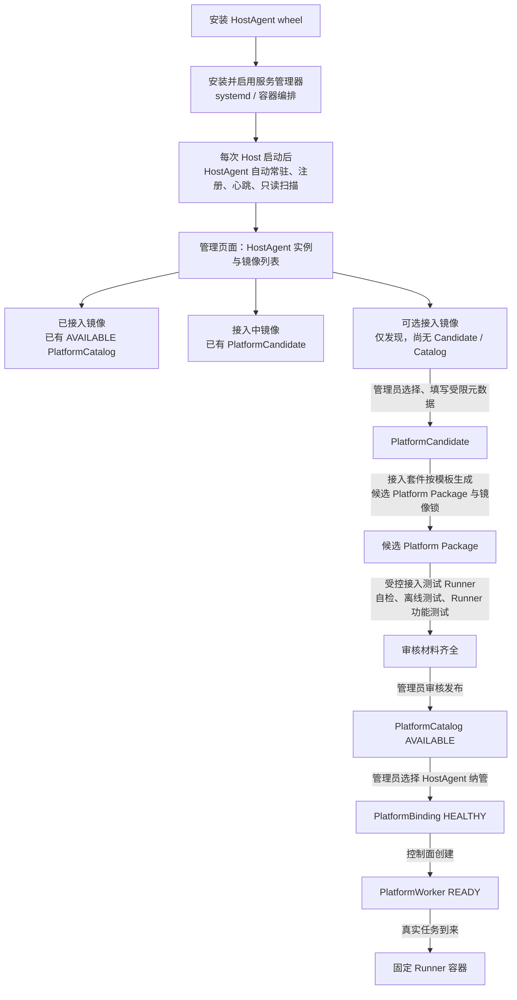

# 平台接入与扩展套件

本文面向**管理员和平台接入人员**。它用 X5 说明怎样把一台已经安装通用 HostAgent 的主机，受控地纳入
Solution Advisor 的 REAL 评测能力。重点是管理员要做什么、每个对象代表什么；不是 X5 工具链或板卡的
操作手册。

> 安全边界：HostAgent 可以发现本机已有的镜像和工具版本，但不能自行把它们发布成平台，也不能自行创建
> Binding。管理员不能从页面传入 Shell、Docker 参数、挂载、主机路径、板卡地址或凭据。

## 一张图理解管理员的工作



其中只有 `AVAILABLE Catalog + HEALTHY Binding + READY Worker` 同时成立时，X5 才会出现在
可创建 REAL 任务的范围内。

## 概念组织框图



`TaskSnapshot` 不在运行拓扑中：它在创建任务时冻结上图中的 Catalog、Binding、Worker、Runner、
镜像锁和规则版本，供后续报告与审计追溯。

## 多工具链 Host 的目标接入流程

一台服务器同时装有 X5、J6 等多个工具链镜像时，您的理解可整理为下图。这里的“镜像”先是
HostAgent 读到的事实，只有经过管理员动作才会进入平台治理对象。



三类镜像在管理页建议使用的视觉状态如下；图标和颜色只用于帮助观察，权限和可调度性必须仍由后端状态
判断，不能由前端颜色决定。

| 页面分组 | 后端事实 | 建议图标 / 颜色 | 管理员可做什么 |
| --- | --- | --- | --- |
| 已接入 | 存在已审核的 `PlatformCatalog`；若还有 HEALTHY Binding 与 READY Worker 则可调度 | ✓ 绿色 | 查看版本、Binding、Worker、历史任务；暂停或升级，不从镜像名直接改平台。 |
| 接入中 | 存在 `PlatformCandidate` 或 `PENDING_INTEGRATION` Catalog | ◐ 琥珀色 | 补齐模板生成的 Package、镜像锁、Runner、自检、离线测试和审核资料。 |
| 可选接入 | HostAgent 只读发现了镜像，但没有关联 Candidate 或 Catalog | ○ 灰蓝色 | 选择该镜像，开始受控接入；未选择前不能创建 REAL。 |

### 需要修正的执行顺序

您的总体逻辑正确，但正式 `PlatformWorker` 的创建位置应当后移：

```text
纯镜像 → PlatformCandidate → 候选 Platform Package + 接入测试 Runner
→ 审核发布 PlatformCatalog → PlatformBinding → PlatformWorker → 正式 Runner 容器
```

原因是 `PlatformWorker` 表示“某个 HostAgent 已被正式授权承载某个已发布 Catalog 的容量槽位”。
Candidate 阶段还没有受审核的平台定义，不能赋予正式 Worker 调度权限。候选阶段需要的是**接入测试
Runner**：它只运行模板中允许的自检、离线测试和 Runner 功能测试，生成审核 Evidence；通过审核后，
才发布 Catalog、创建 Binding 和正式 Worker。

### HostAgent 的安装与常驻运行

`.whl` 只是可安装的软件包，不会因安装完成而自动常驻运行。要满足“安装后以及每次服务器重启后始终
运行”，部署流程必须额外配置服务管理器：

1. 安装通用 HostAgent wheel；
2. 写入受保护的实例配置和 Token Secret 文件；
3. 安装并 `enable` 服务单元（例如 systemd），或将 HostAgent 放入具有 `restart: always` 的受控
   容器编排；
4. 服务管理器在 Host 启动时拉起 HostAgent；HostAgent 注册、心跳和只读扫描成功后，管理页才显示它。

当前系统已经具备 HostAgent 注册、心跳、候选事实记录、Catalog/Binding/Worker 的后端治理基础。
“从页面选择纯镜像 → 自动生成候选 Package → 运行接入测试 → 引导审核发布”、三类镜像的视觉分组、
以及 HostAgent 的 systemd/编排安装器，属于下一阶段要实现的管理交互与接入套件自动化；目前不能把
这些目标流程误表述为已经交付的页面功能。

## 概念、含义与用途

| 概念 | X5 示例 | 含义 | 管理员何时使用 |
| --- | --- | --- | --- |
| **HostAgent** | `x5-a` | 安装在一台 Host 上的通用受控程序。它登记自身、发送心跳、上报只读发现结果、领取已授权任务；不直连 PostgreSQL、Redis、MinIO。 | 确认这台 X5 Host 在线，作为后续 Binding 的承载主体。 |
| **PlatformCandidate** | HostAgent 发现的 X5 工具链镜像摘要 | “可能可以接入的平台环境”的只读预筛对象，不等于平台，更不能评测。它只保留镜像摘要、工具版本和脱敏自检摘要。 | 检查环境是否值得接入，并将其标为待接入。 |
| **PlatformCatalog** | `X5 / 1.0.0` | 审核发布后的、版本化的平台定义，是唯一可以产生 `platform_id` 的来源。包含平台包、镜像 digest、固定 Runner、检查与审核信息。 | 审核材料并发布；暂停或恢复某一平台版本。 |
| **Platform Package** | `platform_packages/x5/` | 平台的可审查实现包：规则、固定 Runner、依赖说明、离线测试等。它描述“如何评测 X5”，但单独存在不表示已上线。 | 审核 Catalog 前验证 Package 版本与内容。 |
| **镜像锁** | X5 工具链镜像的 digest | 不可变镜像身份；避免使用会漂移的 tag 作为真实执行依据。 | 对照实际 HostAgent 环境和 Catalog 审核材料。 |
| **固定 Runner** | X5 `platform_runner` | 平台包中受控的任务执行入口。控制面只选择经过审核的 Runner，不拼接任意 Shell。 | 确认 Runner 名称、版本和离线检查记录。 |
| **PlatformBinding** | `binding_x5_a_x5_1_0_0` | “某台 HostAgent 可以承载某个已发布平台版本”的管理员纳管关系。它记录能力、容量、健康状态和原因。 | 在 Catalog 发布后，将 `x5-a` 与 `X5/1.0.0` 绑定；健康异常时暂停或排查。 |
| **PlatformWorker** | `worker_x5_a_x5_0` | 由控制面在 Binding 下管理的逻辑执行槽位。Worker 领取某类平台任务后才启动固定 Runner 容器。 | 观察 READY/BUSY/OFFLINE/DRAINING/ERROR、容量、当前任务和租约；不手工执行容器命令。 |
| **Runner 容器** | 一次 X5 编译或板端调用 | Worker 运行任务时短时启动的受控执行实体，不是 Platform，也不是 HostAgent。可按策略清理或复用。 | 通过任务、Evidence 和 Worker 状态间接观察；不提供强制命令或删除入口。 |
| **TaskSnapshot** | 某个 X5 REAL 任务的治理快照 | 任务创建瞬间冻结的 Catalog、Binding、Worker、Runner、镜像锁和规则版本。之后改动不会改写历史任务。 | 排查“当时到底用的什么平台定义和执行环境”。 |
| **Artifact / Evidence** | `model.bin`、编译日志、板端 profile | 文件本体在对象存储；数据库仅记录 URI、哈希、类型和元数据。Artifact 是制品，Evidence 是过程证据。 | 从任务详情或 PDF 追溯结果，不把文件塞入数据库。 |

## 以 X5 为例的管理员工作过程

### 0. 接入前的准备：由平台接入人员完成

管理员不应先创建一个名为 `x5` 的自由文本平台。先由平台接入人员在 X5 Host 上准备：

1. 安装并启动通用 HostAgent，给它稳定的 `host_agent_id`（数据库/API 为兼容现有数据仍使用字段
   `agent_id`），例如 `x5-a`；Token 只放受保护的本机 Secret
   文件，不写入 Git、页面、普通日志或 Catalog。
2. 安装 X5 Platform Package、经过确认的工具链镜像和固定 Runner。
3. 运行平台包提供的自检、离线测试和调试工具，产出可审核的脱敏结果。
4. 确认 HostAgent 可向控制面注册和发送心跳。此时 HostAgent 只会报告事实，例如镜像摘要、工具版本和
   自检摘要；它不会自己宣称“我是 X5 平台”。

X5 的参考 Host 配置在 [x5-a-worker-template.yaml](x5-a-worker-template.yaml)。其中
`worker_type: host-agent` 表示它是通用 HostAgent；没有 `platform_id` 字段，因为平台身份只能由
审核后的 Catalog 赋予。

### 1. 看候选，不把候选当平台

进入“管理 → 平台目录与纳管 → 候选发现（只读预筛）”，检查 `x5-a` 上报的候选是否符合预期：

- 镜像摘要与预期工具链一致；
- 工具版本、自检摘要完整且没有敏感信息；
- 该 Host 的 HostAgent 心跳正常。

若值得继续，管理员将 PlatformCandidate 标为 `PENDING_INTEGRATION`。这个动作只是进入接入流程：不会创建
Catalog、Binding 或 Worker，也不会让 X5 出现在评测平台选择项中。

### 2. 形成并审核 X5 PlatformCatalog

管理员或审核人准备 `X5 / 1.0.0` 的版本化 Catalog。发布前必须确认以下材料齐全：

1. Platform Package 的 manifest 和版本；
2. 受控镜像的 digest（不是仅有可变 tag）；
3. 固定 Runner 的模块名和版本；
4. 自检与离线测试结论；
5. 审核人、审核结果和必要说明。

Catalog 最初可处于 `PENDING_INTEGRATION`。材料不完整时后端拒绝发布；这能避免“镜像看起来像 X5”
就被误纳管。审核通过后发布为 `AVAILABLE`，此时仅表示**平台定义可以被纳管**，仍不代表任何 Host
已可执行。

Catalog 状态的含义：

| 状态 | 含义与管理员动作 |
| --- | --- |
| `CANDIDATE_IMAGE` | 仅发现记录，补齐材料或放弃。实际候选通常先记录在 PlatformCandidate 中。 |
| `PENDING_INTEGRATION` | 正在接入，审核 Package、镜像锁、Runner、检查和评审。 |
| `AVAILABLE` | 已审核发布，可被健康 Binding 使用。 |
| `REJECTED` | 审核拒绝；保留审计原因，不能创建 REAL。 |
| `SUSPENDED` | 临时停止新 REAL 任务；历史任务、报告和证据保持可查。排障后可恢复 `AVAILABLE`。 |

### 3. 把 X5 Catalog 纳管到具体 HostAgent：创建 Binding

在“Binding 与动态 Worker”区域，管理员选择：

```text
HostAgent：x5-a
Catalog：X5 / 1.0.0
能力：static_check、compile、board_smoke
最大并发：1
```

这创建 `PlatformBinding(x5-a, X5/1.0.0)`。它表达的是“**这台 Host 的这个 HostAgent 被允许以该版本
X5 定义工作**”，而不是“所有 X5 都可运行”。一个 Catalog 可以被多个 Host 分别绑定；一个 HostAgent
也可以在后续支持多个经过审核的平台 Binding。

Binding 状态由 HostAgent 心跳和受控自检反映：

- `HEALTHY`：可以为该 Binding 创建或复用动态 Worker；
- `OFFLINE`：心跳超时或不可达，等待 HostAgent 恢复或检查 Host；
- `SUSPENDED`：管理员主动暂停该 Host 上的此平台，不影响其他 Binding。

### 4. 确认动态 Worker 和容量，而非手工启动容器

Binding 健康后，控制面创建或复用其下的 `PlatformWorker`，例如
`worker_x5_a_x5_0`。管理员在管理页检查：

- Worker 状态为 `READY`；
- `运行 / 上限` 和空闲槽位正确，例如 `0 / 1`；
- 最近心跳正常，没有脱敏错误；
- 固定 Runner 版本和 Catalog 中的版本一致。

`BUSY` 表示容量已用完，新的任务保持排队；`READY` 表示有槽位；`OFFLINE`、`DRAINING` 或 `ERROR`
表示不能创建新的 REAL 任务。容量租约的事实存放在 PostgreSQL 中，Redis 只协助调度，不能单独决定容量。

### 5. 创建并追溯受控 X5 REAL 任务

只有第 2～4 步均正常时，管理员才能从管理页创建受控 REAL 任务。当前 X5 已有能力必须分别理解：

| 任务类型 | 做什么 | 不代表什么 |
| --- | --- | --- |
| M4-A 编译 | 对已分析的 ONNX 做固定 X5 静态检查与编译，登记 `model.bin` 和日志 Evidence。 | 不代表板端已运行，也不代表性能、精度或部署推荐。 |
| M4-B-R0 板端冒烟 | 引用成功编译的 `model.bin`，执行固定 Runtime `hrt_model_exec perf` 流程，并保存受控证据。 | 不代表精度、稳定性、功耗或推荐部署。 |
| `x5-hrt-profile-1.0` 解析 | 从已保存 profile 原始数据中解析本次的 FPS、Latency、分段和 CPU 算子边界。 | 不能扩展为跨版本、稳定性或交付性能结论。 |

任务创建时会写入 `TaskSnapshot`；管理员在任务详情和 PDF 的“平台目录与执行快照”中可核对：
`platform_id`、Catalog 版本、Binding、Worker、Runner、镜像锁与规则版本。这样即使后续暂停 Catalog、
更换 Binding 或升级 Runner，历史事实也不会被改写。

### 6. 日常治理与异常处理

| 情况 | 管理员动作 | 系统行为 |
| --- | --- | --- |
| 发现 X5 工具链或镜像问题 | 暂停对应 Catalog 或 Binding，记录原因并排障。 | 阻止新 REAL；历史 Artifact、Evidence、报告和 PDF 仍可查。 |
| 单台 X5 Host 故障 | 将该 Binding 置为暂停或等待其 HostAgent 心跳变为 OFFLINE。 | 其他 Host 上针对同一 Catalog 的健康 Binding 不受影响。 |
| Runner / 镜像 / 规则要升级 | 建立新的 Catalog 版本，重新审核并建立相应 Binding。 | 新任务使用新快照；历史任务保持旧快照。 |
| 容量满 | 查看 Worker 运行数、租约和队列。 | 任务保持 `QUEUED`，不会突破 `max_concurrency`。 |
| PlatformCandidate 不符合标准 | 标记拒绝或不进入接入。 | 不会自动成为可评测平台。 |

## 管理员检查清单

创建 X5 REAL 任务前，逐项确认：

- [ ] PlatformCandidate 的只读事实与审核材料一致；
- [ ] X5 Catalog 已审核发布为 `AVAILABLE`；
- [ ] `x5-a` 的 Binding 为 `HEALTHY`，且能力与任务匹配；
- [ ] 至少一个该 Binding 下的 PlatformWorker 为 `READY`，并有空闲容量；
- [ ] 任务来源是已完成通用 ONNX 分析的 Model Profile；
- [ ] 任务将使用固定 Runner、镜像锁和受限输入，未携带任何任意命令或凭据；
- [ ] 已明确本次任务能证明的范围，以及所有 `NOT_VERIFIED` 边界。

## 相关 API（管理员 Token 保护）

管理页调用以下 API；接口均拒绝未授权访问。页面是日常入口，API 主要用于集成测试和受控运维，
不建议把 Token 放进 URL 或脚本参数。

```text
GET/POST /api/admin/platform-catalogs
POST     /api/admin/platform-catalogs/{catalog_id}/publish
POST     /api/admin/platform-catalogs/{catalog_id}/state
GET      /api/admin/platform-candidates
POST     /api/admin/platform-candidates/{candidate_id}/integration
GET/POST /api/admin/platform-bindings
POST     /api/admin/platform-bindings/{binding_id}/state
GET      /api/admin/platform-workers
GET      /api/admin/platform-audits
```

本套件的目标是让管理员能清楚地回答三个问题：**哪个经过审核的平台版本可以用、哪台运行 HostAgent 的 Host
被允许承载它、当前是否有受控容量可以执行任务**。只有三个答案都明确，系统才允许发起 REAL 评测。

## Candidate Package 的持久化与跨 Host 复用

从纯镜像创建 Candidate 时，控制面生成一个版本化 ZIP Package Artifact，并将其写入配置的对象存储；
数据库仅保存 Artifact URI、哈希、类型和审核关联。不会在控制面容器、A Host 或任意临时目录写入候选包。
该 Package 只包含固定清单、镜像锁、固定 Runner 契约和离线测试契约；不包含 Shell、Docker 参数、主机
路径、凭据、真实编译或板卡访问。

固定的 `candidate-integration-runner-v1` 只读取该 Artifact，核对 Package 清单、固定正式 Runner 契约和
不可变 digest，并生成独立 Evidence。它不是正式 Worker Runner。审核发布后，Catalog 关联的是 Package
声明的固定 `platform_runner`；只有随后创建的 HEALTHY Binding 才能产生正式 Worker。

镜像内容不会从 A Host 复制给 B Host。B 必须由其自己的 HostAgent 只读发现可用于该平台版本的镜像；
管理员在创建 Binding 时确认其平台类型、版本和固定 Runner 规则一致。Catalog 参考 digest 与 B 的实际
digest 一致时记为一致；不同则记录告警和实际镜像追溯，但不阻断经过管理员确认的版本/规则复用。
Catalog、Package Artifact 和 Evidence 是控制面共享资产，A/B 的镜像事实、Binding 与 Worker 则各自归属
对应 Host。

HostAgent 会在发现阶段排除以 `solution-advisor` 或 `solution_advisor` 开头的控制面自身镜像，避免 API、
Web、Analyzer 等同机 Compose 服务误进入“可选择接入”。接入中的 Candidate 若尚未关联 Catalog，当前
认领管理员可以归档它，超级管理员可按审计原因归档或恢复；归档会释放 claim，保留 Package Artifact、
Evidence 和审计记录，不会影响已关联 Catalog 的 Candidate。在当前单管理员 Token 部署中，该管理员同时是
Candidate 创建者和超级管理员；多管理员部署应将该主体映射到身份系统中的创建者/超级管理员权限。

## 平台配置备份与恢复

管理员或超级管理员可在“系统设置 → 平台配置备份与恢复”选择一个或多个已发布 Catalog，导出一个紧凑的 ZIP 配置备份包。包内仅有
平台类型、版本、显示名称、平台 Package 清单、镜像锁、固定 Runner 发布信息、检查结果和审核摘要；它不含
Candidate 临时资料、Binding/Worker、用户模型或评测、Artifact/Evidence 二进制、Host 地址、板卡资料、
Token、密码和其他 Secret。

目标控制面导入后恢复的是**可审查的平台能力定义**，并保留导入审计；同一“平台类型 + 版本”若内容不同会拒绝
覆盖，内容相同则安全跳过。导入不复制镜像、不自动连接 Host，也不创建 Binding 或 Worker。目标 Host 必须自行
发现匹配镜像并安装相同 Runner，管理员随后建立 HEALTHY Binding 与 READY Worker；满足这些调度条件后，用户
才可选择该平台评测。导出时系统以白名单抽取平台静态定义；历史 Catalog 中的 Candidate、Evidence、Host 或执行资源溯源字段不会进入备份包。
