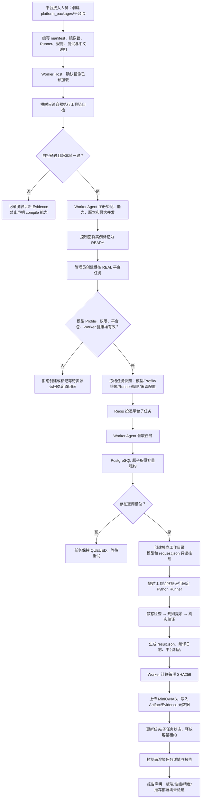
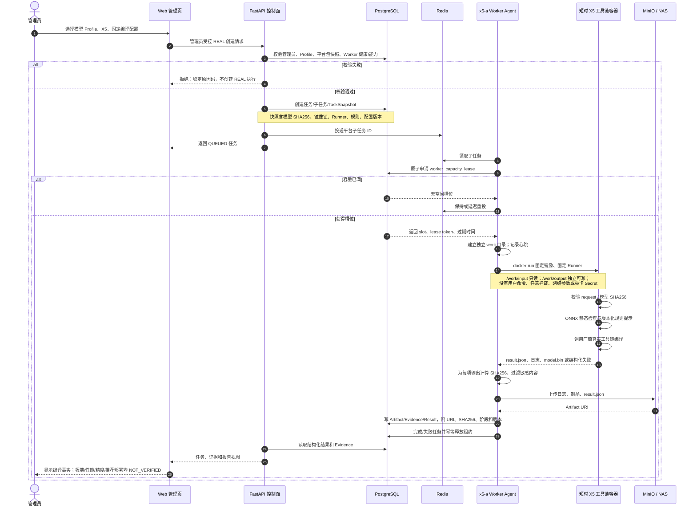

# X5 平台包与新平台接入说明

本目录是 `x5-a` Worker Agent 唯一允许使用的 X5 执行定义。它把镜像、固定
Runner、规则、报告边界和测试放在同一个可审查、可版本化的目录中；控制面不直接
调用工具链命令，也不接受用户提供的镜像、Shell 命令、挂载或宿主机路径。

本文既说明当前 X5 平台包，也可作为接入新平台（例如 J6M）的模板。新平台应复制
目录结构并替换平台专有内容，而不是修改通用 ONNX 分析器或在 FastAPI 服务中加入
工具链逻辑。

## 1. 运行上下文

```text
管理员创建受控 REAL 平台任务
        ↓
控制面冻结模型/Profile/平台包/镜像/规则版本快照并投递任务
        ↓
对应 Worker Agent 取得 PostgreSQL 容量租约
        ↓
按 manifest 和 image.lock 启动短时工具链容器
        ↓
python -m platform_runner execute --request /work/input/request.json --result /work/output/result.json
        ↓
Worker 校验 SHA256，上传制品/Evidence，控制面生成任务页与报告
```

M4-A 只允许静态检查和编译；板卡连接、SSH、性能、精度、稳定性和推荐部署属于
后续 M4-B。即使编译成功，报告也只能写“在指定工具链、镜像、平台包和固定编译
配置下编译成功”，不能写成板端可运行或推荐部署。

## 1.1 平台接入与执行流程图



## 1.2 REAL 静态检查与编译序列图



## 2. 典型目录结构

```text
platform_packages/
└── x5/                              # 平台 ID；新平台示例可为 j6m/
    ├── README.md                     # 必需：本说明与平台接入边界
    ├── manifest.yaml                 # 必需：平台包的机器可读入口
    ├── docker/
    │   ├── image.lock.yaml           # 必需：镜像、工具链与自检锁定
    │   └── Dockerfile.runner         # 按需：需要受控派生镜像时使用
    ├── runner/
    │   └── platform_runner/
    │       ├── __init__.py           # 必需：Python 包标识
    │       └── __main__.py           # 必需：唯一固定执行入口
    ├── rules/
    │   ├── rules.yaml                # 必需：规则版本、边界与声明
    │   └── x5_rules.py               # 按需：静态规则、日志解析等实现
    ├── reports/
    │   └── README.md                 # 必需：平台报告专有字段与禁用表述
    ├── tests/
    │   ├── static-request.json       # 必需：最小 Runner 请求 fixture
    │   └── compile-request.json      # 有编译能力时必需：固定编译请求 fixture
    └── worker-agent/
        └── README.md                 # 必需：Worker Host 安装与运行边界
```

运行时文件不属于平台包，不得提交到 Git：Worker 的注册令牌与密钥在
`/etc/solution-advisor/secrets/<instance>/`；配置在
`/etc/solution-advisor/workers/<instance>/config.yaml`；临时工作目录在
`/var/lib/solution-advisor/worker/<instance>/work/`；运行日志在
`/var/log/solution-advisor/worker/<instance>/`。镜像 tar、真实模型、编译日志、
X5 的 `model.bin` 等制品保存在 MinIO/NAS 或 Worker Host，不进入 Git。

## 3. 文件清单、必需性和影响

| 文件或目录 | 是否必需 | 用途 | 被谁使用 | 缺失的影响 |
|---|---|---|---|---|
| `README.md` | 必需 | 说明接入、部署、边界和验收口径 | 平台接入人员、运维、评审 | 无法审查或重复接入，禁止作为正式 REAL 平台发布 |
| `manifest.yaml` | 必需 | 声明平台 ID、版本、能力、Runner、规则和镜像锁 | 控制面、Worker 注册和任务快照 | 无法识别平台包版本和允许能力，不能创建任务 |
| `docker/image.lock.yaml` | 必需 | 锁定镜像引用/Image ID/digest、工具链版本和自检命令 | Worker 自检、发布审计、任务 Evidence | 无法证明工具链来源与版本，禁止声明编译能力 |
| `docker/Dockerfile.runner` | 可选 | 在官方镜像上增加固定 Runner 或依赖 | 镜像构建流程 | 若 Runner 可通过只读挂载运行可省略；若需派生依赖却缺失，则不能构建受控镜像 |
| `runner/platform_runner/__main__.py` | 必需 | 校验请求与 SHA256、调用固定工具链、输出 `result.json` | 短时工具链容器 | 没有唯一受控入口，Worker 不得执行任意脚本替代 |
| `runner/.../__init__.py` | 必需 | 使 Runner 可被 `python -m` 可靠加载 | Python 运行时 | Runner 启动不稳定或无法导入 |
| `rules/rules.yaml` | 必需 | 规则版本、适用范围、禁止性结论 | Runner、报告、审计 | 规则无版本和边界，静态结论不可追溯 |
| `rules/*.py` / `*.yaml` | 按需 | 算子约束、风险提示、日志解析、厂商规则 | Runner 静态检查/结果解析 | 可无平台静态推断；仍可仅执行真实编译，但报告需明确未提供规则预检 |
| `reports/README.md` 或模板 | 必需 | 定义平台专有章节、证据字段、禁止措辞 | 报告 ViewModel/前端 | 容易将编译、板端和推荐结论混淆，不能交付正式报告 |
| `reports/*.jinja` / `*.py` | 可选 | 平台专有报告模板或渲染器 | 报告服务 | 没有专有展现时可使用通用章节，但 Evidence 字段仍必须可见 |
| `tests/static-request.json` | 必需 | 固定、离线的最小 Runner 契约输入 | 单测、镜像自检 | 无法验证请求/结果协议和静态检查 |
| `tests/compile-request.json` | 有 `compile` 时必需 | 固定编译参数与模型 SHA256 | 单测、真实工具链验收 | 编译配置不可重复，不能启用 `compile` 能力 |
| `tests/*` | 必需 | Schema、规则、成功/失败/超时和脱敏回归 | CI | 无自动化验证，不得将新平台标记为可用 |
| `worker-agent/README.md` | 必需 | 安装目录、Secret、systemd/开发运行、清理和权限约束 | 运维和 Worker Host 管理员 | 平台可运行但不可部署、不可安全运维 |

## 4. 必须遵守的协议

### 4.1 manifest.yaml

至少应包含以下信息：

```yaml
schema_version: "1.0"
id: j6m
version: "1.0.0"
capabilities: [static_check, compile]
runner: {module: platform_runner, version: "1.0.0"}
rules: {version: "1.0.0"}
image_lock: docker/image.lock.yaml
```

能力只能声明实际通过镜像自检和 Runner 验收的项。M4-A 不能声明 `board_test`；
如镜像自检失败，Worker 必须降为 `DEGRADED` 或 `OFFLINE`，并拒绝 `compile`。

### 4.2 Runner 请求与结果

Runner 只能接受由控制面写入的 `/work/input/request.json` 与受控模型文件。请求至少
包括：协议版本、任务/子任务 ID、`static_check` 或 `compile` 能力、模型 URI/ID/SHA256、
Model Profile 引用、固定编译配置、平台包/规则/Runner/镜像版本、deadline 与取消信息。

Runner 必须写出 `/work/output/result.json`，其中至少包括阶段状态、输入 SHA256、工具链
和镜像事实、平台包/规则/Runner 版本、静态规则结果、编译状态/原因码、Artifact 与
Evidence 声明，以及：

```text
board_validation = NOT_EXECUTED
performance = NOT_VERIFIED
accuracy = NOT_VERIFIED
deployment_recommendation = NOT_VERIFIED
```

Artifact/Evidence 中每个文件都应含 SHA256、大小、类型和阶段。X5 真实编译产物为
`.bin`，不能误标为 HBM；不同平台使用自身真实产物类型。

## 5. 用 X5 作为示例的接入步骤

1. 记录预加载镜像的 tag、Image ID/digest、创建时间、OS/架构，并在短时只读容器中
   执行工具链自检；不要在任务运行时 `docker load`。
2. 创建 manifest 和 image lock，先只声明经自检的能力。
3. 实现固定 Python Runner。控制面只能请求能力，不得传入工具链命令。
4. 将厂商手册、已验证日志模式和可审查规则放入 `rules/`；规则输出必须标注为提示，
   真实编译日志才是执行事实。
5. 准备版本化小模型和固定请求 fixture，分别验证静态检查、编译成功、编译失败、超时
   和 SHA256 不匹配。
6. 安装 Worker Agent，使用专用注册令牌注册实例、上报心跳和容量；先取得 PostgreSQL
   容量租约再启动短时容器。
7. 将 `result.json`、日志和编译产物上传对象存储，数据库只保存 URI、SHA256、大小、
   阶段、版本和可见性。
8. 最后才在管理页、REAL 任务页和报告中展示经过审核的执行事实与 Evidence。

## 6. 接入 J6M 的最小路线

以 X5 为模板创建 `platform_packages/j6m/`，将 `id`、镜像锁、工具链自检命令、Runner
内部固定命令、规则和制品类型替换为 J6M 的真实定义。不要复制 X5 的 `bayes-e`、
`hb_mapper`、`.bin`、算子规则或结论。

J6M 最小可用接入应依次达到：

1. **仅静态检查：** manifest、镜像锁、Runner、规则、静态 fixture 与单测齐全；
2. **允许编译：** 再增加固定编译 request、真实工具链编译与日志/制品 SHA256 验收；
3. **允许 REAL：** 控制面权限、Worker 注册/心跳、容量租约、对象存储 Evidence、页面和
   报告闭环全部通过；
4. **允许板端验证：** 仅在 M4-B 增加受控 Secret、连接检查与板端执行，不能复用 M4-A
   的编译成功替代板端事实。

达到这些要求后，即使接入人员此前没有接入过任何平台，也能按目录、协议、测试和验收
步骤完成一个可审查、可回归、可运维的新平台包，而不会把平台专有逻辑扩散到控制面。
